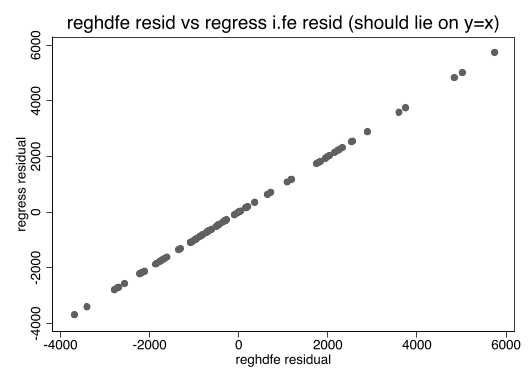

# Stata Skills（基于《A Gentle Introduction to Stata》第 6 版）

> **装上即让 Agent 会跑 Stata 因果推断：9 个 DiD 估计量 · 10/10 实测验证 · 一条命令安装。**
>
> 10 个 Skill · 10 个验证入口 · 6 ADR · 38 个 AGIS6 数据集 · 27 条 Agent 行为回归 prompt。把 Acock 教材 800 页压成 4 个章节 Skill，
> 再扩展 coefplot、DID、RDD、selection-on-observables 与跨设计 identification router——中文实证研究者装上即可用。

[English summary](#english-summary) | [中文说明](#中文说明)

> 🎯 **10 个 Skill · 10 个验证入口 · 10/10 verify PASS · 38 个数据集（AGIS6）· 27 张 demo PNG · 27 条 Agent 行为回归 prompt**

[](LICENSE)
[](docs/run-stata.md)
[](https://github.com/jefeerzhang/stataskills/actions/workflows/verify.yml)
[](https://github.com/jefeerzhang/stataskills)

[](https://skills.sh/jefeerzhang/stataskills/stata-basics)
[](https://skills.sh/jefeerzhang/stataskills/stata-descriptives)
[](https://skills.sh/jefeerzhang/stataskills/stata-regression)
[](https://skills.sh/jefeerzhang/stataskills/stata-advanced)
[](https://skills.sh/jefeerzhang/stataskills/stata-coefplot)
[](https://skills.sh/jefeerzhang/stataskills/stata-did)
[](https://skills.sh/jefeerzhang/stataskills/stata-did-community)
[](https://skills.sh/jefeerzhang/stataskills/stata-rdd)
[](https://skills.sh/jefeerzhang/stataskills/stata-selection)
[](https://skills.sh/jefeerzhang/stataskills/stata-identification)


## 特性

- **4 个教材分章节 Skill + 6 个扩展**：basics / descriptives / regression / advanced 对应教材第 1–16 章 + 附录 A；扩展覆盖 coefplot、官方与社区 DID、RDD、selection-on-observables 和 identification router
- **完整命令 + 解读逻辑 + 报告惯例 + 关键陷阱速查**，按强制路径和 references 渐进加载
- **38 个 AGIS6 配套数据集 + 项目级扩展数据**：分别由 `data/manifest.txt` 与 `data/manifest-extra.txt` 管理
- **可一行复现的 verify harness**：`bash verify/run-verify.sh` 动态发现 10 个 skill 验证入口
- **真实 demo** 报告：8 个 do-file + 27 张 PNG + 完整 REPORT.md（含 reghdfe 与 regress i.fe 残差对比图 + panelview 缺失模式与处理状态 + fect Estimated ATT 时序图 + coefplot 森林图 + DID didregress/xtdidregress/hdidregress/xthdidregress 全部命令族 + Bacon 分解图）
- **高维固定效应 `reghdfe`**：2+ 层 FE / 多向聚类 / IV-GMM 吸收 FE / 自动剔除单点组（见 stata-regression 10.5 节）
- **工程化外壳领先**：ADR-0001 + verify + manifest + stata.conf 四条单一来源





## 为什么做这个项目

给 Agent 写 Stata 代码，最怕的不是它不会写，而是它写得像会。

问一句「帮我跑个错时 DID」，常见的结果是一段结构完整的代码——命令名对、选项像样，但它可能在这一版 Stata 上根本没跑过，用的估计量也可能配不上你的数据。期刊审稿人不会因为「这是 Agent 生成的」就少看半行；你得对每一个命令负责。stataskills 想消掉这层赌的成分：凡是写进 SKILL.md 的命令链，都在这台机器上用 Stata 19.5 批处理跑过，原始 log 留在 `verify/` 里当证据。

另一个动机是「方法选择」这类知识太散。错时 DID 该走 hdidregress、csdid 还是 jwdid？断点回归读 `e(tau_cl)` 还是 `e(tau)`？恰好识别时 Hansen J 去哪了？这些答案散在论坛、期刊附录和 help 文件里，每次现查一遍等于让 Agent 重新踩一遍坑。把它们固化进强制路径、陷阱四件套和黑名单，就是把踩过的坑变成路标。

最后是对教材的尊重。Acock 的《A Gentle Introduction to Stata》本来就把「从数据到结果」讲得清清楚楚，我们做的不是另起炉灶，而是让 Agent 能按章节级粒度调用它——教材提供为什么，仓库提供怎么跑、跑完怎么验证。

这个仓库的验收标准只有一条：**写进去的命令都有日志，没验证过的都不写。**

## 你什么时候需要它？

- 你是实证研究者（社科 / 经济 / 公共卫生），想用 Stata 但不想读完整本教材
- 你已经会基础 Stata，想做 ANOVA / 多元回归诊断 / 逻辑回归 / SEM（结构方程） / 多层 / IRT 等进阶分析
- 你在 Claude Code / Codex / OpenClaw 里跑 Agent，需要让 Agent 自己会写 do-file

## 快速开始

### Marketplace 一行安装（推荐）

```bash
# ClawHub / skills.sh marketplace
npx skills add jefeerzhang/stataskills
```

### 传统 git clone

```bash
# 1. 克隆到 Claude Code / Codex / OpenClaw 的 skills 目录
git clone https://github.com/jefeerzhang/stataskills.git ~/.claude/skills/

# 2. （可选）验证：需要本机 StataNow 19.5（macOS / Windows 路径见 docs/run-stata.md）
bash verify/run-verify.sh
# 预期：10 个验证入口全部通过；默认模式允许可选社区包缺失，--community 强制必需社区包
```

## 触发方式

- **Slash 命令**：`/stata-basics` · `/stata-descriptives` · `/stata-regression` · `/stata-advanced` · `/stata-coefplot` · `/stata-did` · `/stata-did-community` · `/stata-rdd` · `/stata-selection` · `/stata-identification`
- **自然语言**：「用 Stata 帮我做多元回归诊断」/「这份数据能否作因果解释」/「用 IPWRA 估计 ATET」
- **路由表**：明确点名方法时直达对应方法 skill；通用设计选择先走 `stata-identification` 的 stop rules。分数线 / 年龄门槛 / 地理边界路由到 `stata-rdd`，不进入 DID。

| 用户问题 | 路由到 |
|---|---|
| 录入 / 标签 / 反向编码 / 构建量表 | `stata-basics` |
| 描述统计 / 交叉表 / t 检验 / 相关 | `stata-descriptives` |
| ANOVA / 多元回归 / 逻辑回归 / 功效 / 多维 FE（reghdfe） | `stata-regression` |
| 因子 / SEM / 多重插补 / 多层 / IRT | `stata-advanced` |
| 系数图 / 森林图 / 多模型系数对比 / 发表级 coefplot | `stata-coefplot` |
| 时间断点政策 / 平行趋势 / 错时 DID（内置命令） | `stata-did` |
| 合成控制 / 可逆处理 / csdid / jwdid / 非线性 DID | `stata-did-community` |
| 分数线 / 年龄门槛 / 地理边界断点 | `stata-rdd` |
| PSM / IPW / IPWRA / `teffects` / entropy balancing | `stata-selection` |
| 该选什么设计 / 能否识别 / 能否作因果解释 | `stata-identification` |
| 政策实施年月（时间断点） | `stata-did`（RDiT，不是标准 RDD） |

## Quick Reference：用户原话 → 读哪几个文件

> 借鉴 dylantmoore/stata-skill 的 Quick Reference 模式：路由表回答「去哪个 skill」，本表回答「打开 skill 后读哪个 references / 章节」。Agent 触发后不必全量加载，按表定位即可。

| 用户原话 | 加载 skill | 重点读 |
|---|---|---|
| "帮我把缺失码 .a/.b 转成 ." | `stata-basics` | 「3.1 缺失值代码转 Stata 缺失值」+「关键陷阱速查 #4」 |
| "用 Stata 跑卡方 + 效应量" | `stata-descriptives` | 「卡方检验 + Cramér's V」+「黑名单『不要只报 p 不报效应量』」 |
| "price ~ weight + foreign 的 ANCOVA" | `stata-regression` | `references/anova.md` + `references/regression.md` |
| "用 reghdfe 跑高维 FE" | `stata-regression` | `references/reghdfe.md`（absorb/vce/noconstant） |
| "画森林图对比两个 logit 模型" | `stata-coefplot` | 「强制路径」+ `references/intermediate.md` 多模型段 |
| "OR 图参考线用 1 还是 0？" | `stata-coefplot` | 「关键陷阱速查 OR」+ `references/advanced.md` eform 段 |
| "错时 DID 估计 ATET" | `stata-did` | 「强制路径」+ didregress / hdidregress 选择 + atetplot / bdecomp |
| "csdid 估计 + 事件研究 + 平行趋势" | `stata-did-community` | `references/csdid-jwdid-imputation.md` csdid 段 |
| "合成控制 DID" | `stata-did-community` | `references/synth.md` + `references/workflow-8step.md` |
| "分数线 70 分处 RDD 因果效应" | `stata-rdd` | 「6 步工作流」+ sharp 验合规 + rdrobust + rddensity + placebo |
| "横截面二元处理用 IPWRA 估计 ATET" | `stata-selection` | 强制路径 + `references/teffects-ipwra.md` + `references/balance-overlap.md` |
| "这份数据该选哪种因果设计？" | `stata-identification` | `references/identification-decision-tree.md` + `references/identification-common-assumptions.md` |
| "如何做 IRT" | `stata-advanced` | `references/` IRT 段（第 16 章）+ 「黑名单『alpha 不是删条依据』」 |
| "do-file 跑完报 r(N) 错" | **所有 skill 通用** | 各 skill 「错误码速查」节 |

> 触发后只读「重点读」列即可；其它 references 按需懒加载。

来自 demo/REPORT.md 的真实运行结果（macOS StataNow 19.5 MP）：

| Skill | 关键结果 |
|---|---|
| basics | 清洗 auto.dta → 74 obs × 12 vars，`rep78` 缺失 5，保存为 `data/auto_clean.dta` |
| descriptives | `rep78 × foreign` χ²(4)=27.26, p<0.001, Cramér's V=0.63 |
| regression | `price ~ weight + foreign` ANCOVA F=35.35, p<0.001, R²=0.499 |
| advanced | `factor ... , pcf` 保留 1 因子解释 74.3% 方差 |
| did | `didregress` ATET=2.01（与 DGP 真值 2.0 一致）· hdidregress 错时 cohort ATET 聚合 · Bacon 分解（TWFE 权重诊断）|

完整命令 + 全部结果见 [demo/REPORT.md](demo/REPORT.md)。

## 它和同类有什么不同？

| 维度 | stataskills（本仓库） | [dylantmoore/stata-skill](https://github.com/dylantmoore/stata-skill) (276⭐) | [codex-stata-for-economists](https://github.com/maxwell2732/codex-stata-for-economists) |
|---|---|---|---|
| 教材驱动 | ✅ AGIS6 全 16 章 + 附录 A | ❌ | ⚠️ 章节切片 |
| 配套数据 | ✅ 38 个 AGIS6 `.dta` + 受治理的项目级扩展数据 | ❌ | ❌ |
| 验证 harness | ✅ 一行命令动态运行 10 个验证入口 | ❌ | ⚠️ log 验证 |
| Agent 行为回归 | ✅ `test-prompts.json` 27 条 prompt + 动态 skill / route_branch 断言；`--llm` 模式本机实测转绿 | ❌ | ❌ |
| Demo 报告 | ✅ 8 个 do-file + 27 PNG + REPORT.md | ❌ | ❌ |
| ADR / 架构决策 | ✅ ADR-0001 至 ADR-0006 | ❌ | ❌ |
| 单一来源 | ✅ 双 manifest + target registry + `verify/stata.conf` | ❌ | ❌ |

我们不是「又一个 Stata skill」——是**唯一带完整数据 + verify + Agent 行为回归 + ADR + demo 的工程化外壳**。

## 安全边界

- **默认英文标签作图**：Stata 图形 PostScript 字体不支持中文，会渲染为乱码；需要中文图表时先与用户确认（详见 `docs/run-stata.md`）。
- **不会自动运行你的数据**：所有命令都在 do-file 里，由你控制何时 `do file.do`。
- **已下线 UCLA 包标注**：`chitable` / `chi2power` / `powerreg` / `powerlog` 随 UCLA 服务器下线无法联网安装；各 SKILL.md 已标注等价命令（如 `power twoproportions`、`power rsquared`）。
- **教材原文版权**：`book/` 包含 Alan C. Acock《A Gentle Introduction to Stata》(6th ed.) 原文，仅供教学参考，版权归 Stata Press；详见 [LICENSE](LICENSE) 的附加声明段。

## 文件结构

```
stataskills/
├── README.md                       ← 本文件
├── CLAUDE.md                       ← Agent 工作约定
├── LICENSE                         ← MIT（含教材版权声明）
├── CHANGELOG.md                    ← 变更历史
├── CITATION.cff                    ← 学术引用
├── download_data.do                ← 一键下载全部数据
├── test-prompts.json               ← 27 条 Agent 行为回归测试（动态覆盖 10 skills）
├── stata-basics/SKILL.md           ← skill 1（数据管理 / 清洗）
├── stata-descriptives/SKILL.md     ← skill 2（描述 / 检验）
├── stata-regression/SKILL.md       ← skill 3（回归 / IV）
├── stata-advanced/SKILL.md         ← skill 4（因子 / SEM / 多层 / IRT）
├── stata-coefplot/SKILL.md         ← skill 5（系数图 / 森林图）
├── stata-did/SKILL.md              ← skill 6（双重差分 DID 内置命令族）
├── stata-did-community/SKILL.md    ← skill 7（DID 社区包：csdid/jwdid/synth/sdid）
├── stata-rdd/SKILL.md              ← skill 8（断点回归）
├── stata-selection/SKILL.md        ← skill 9（selection-on-observables）
├── stata-identification/SKILL.md   ← skill 10（识别设计 router）
├── book/                           ← 教材原文 Markdown（教学使用）
├── data/
│   ├── manifest.txt                ← 38 个 AGIS6 .dta 清单（单一来源）
│   ├── manifest-extra.txt          ← 项目级扩展数据清单（单一来源）
│   ├── agis6/                      ← 完整 AGIS6 数据集
│   └── selection/                  ← 项目内生成的 selection 教学数据
├── docs/
│   ├── run-stata.md                ← 平台命令速查（单一来源）
│   ├── adr/                        ← 6 份架构决策（ADR-0001 至 ADR-0006）
│   └── agents/                     ← Agent 工作流
├── verify/                         ← 验证 harness
│   ├── run-verify.sh               ← 动态发现并运行 10 个验证入口
│   ├── check-claims.sh             ← 文档断言检查（facts vs 计数）
│   ├── test-harness.sh             ← 判定逻辑与 sentinel 回归测试
│   ├── test-prompts.sh             ← 动态 skill / route_branch 回归测试
│   ├── stata.conf                  ← 平台路径（单一来源）
│   ├── lib/                        ← 共享 report 与 target registry
│   └── verify-<skill>.{do,log}     ← 10 个验证入口（did-community 使用 registry 委托）
└── demo/                           ← 端到端示例
    ├── REPORT.md                   ← 完整报告
    ├── dofiles/                    ← 8 个 do-file（含 did）
    ├── logs/                       ← 8 个 Stata log（exit=0）
    └── output/                     ← 27 张真实 PNG
```

## 验证与测试

```bash
bash verify/run-verify.sh --static  # 静态层（无需 Stata，与 CI 同款）
bash verify/test-harness.sh         # harness 与社区 sentinel 语义
bash verify/test-prompts.sh         # 动态 skill / route_branch 文档回归
bash verify/test-prompts.sh --llm   # Agent 行为回归实测（claude CLI + API key 或 OAuth 登录态任一）
bash verify/check-claims.sh          # 文件系统 facts 与活跃声明
bash verify/run-verify.sh            # 全量 10 个验证入口（需本机 Stata）
bash verify/run-verify.sh selection  # 单个 skill
```

GitHub Actions（`.github/workflows/verify.yml`）在 push/PR 自动跑 Stata-free 静态层：
version 政策、双 manifest 一致性、shellcheck、动态文档 claims 与 Agent 路由回归。
执行层由本机 `bash verify/run-verify.sh` 运行；默认模式允许 optional 社区包缺失，
`--community` 强制必需社区包。raw logs 按 ADR-0005 保留。

**判定标准**：日志恰好一次 `end of do-file`，且无 `r(错误码)`、静默错误；optional sentinel 不得掩盖真实错误。
当前同轮实测：**10/10 PASS**。默认模式中缺失的必需社区包按 cap/sentinel 语义跳过；需要强制安装覆盖时使用 `--community`。

## 本地开发

修改任何 skill 内容后，重跑静态层和全量验证：

```bash
bash verify/run-verify.sh
```

如果改动了命令，需要同步三处（按 ADR-0001 决策）：

- `*/SKILL.md`（教学围栏）
- `verify/verify-*.do`（验证 harness）
- `data/agis6/chapter*.do`（教材原文）

详见 [CHANGELOG.md](CHANGELOG.md)。

## 引用本 Skill

见 [CITATION.cff](CITATION.cff)（含 APA / BibTeX）。

同时请引用原教材：

> Acock, A. C. (2018). *A Gentle Introduction to Stata* (6th ed.). Stata Press.

## 致谢

- 教材原文：Alan C. Acock《A Gentle Introduction to Stata》(6th ed., Stata Press, 2018)
- 高维固定效应：[reghdfe](https://github.com/sergiocorreia/reghdfe)（**Noah Constantine & Sergio Correia**，里士满联储；[Correia 2017](http://scorreia.com/research/hdfe.pdf)；RePEc [S457874](https://ideas.repec.org/c/boc/bocode/s457874.html)；DOI [10.5281/zenodo.27755549](https://doi.org/10.5281/zenodo.27755549)）
- IV / 2SLS + 多维固定效应：[ivreghdfe](https://github.com/sergiocorreia/ivreghdfe)（Sergio Correia，2024；DOI [10.5281/zenodo.82003805](https://doi.org/10.5281/zenodo.82003805)）
- 面板数据可视化：[panelview](https://github.com/xuyiqing/panelview_stata)（Hongyu Mou & Yiqing Xu；[Mou, Liu & Xu (2023) JSS 107(7)](https://doi.org/10.18637/jss.v107.i07)）
- 面板因果推断 / TWFE 偏差修正：[fect](https://github.com/xuyiqing/fect_stata)（Licheng Liu, Ye Wang, Yiqing Xu, Ziyi Liu；[Liu et al. (2020) SSRN 3555463](https://papers.ssrn.com/abstract=3555463)；MIT 2020）
- 同类项目参考：[dylantmoore/stata-skill](https://github.com/dylantmoore/stata-skill)、[hanlulong/stata-mcp](https://github.com/hanlulong/stata-mcp)、[codex-stata-for-economists](https://github.com/maxwell2732/codex-stata-for-economists)
- 教材 → Skill 元流程参考：[Leutenegger/book-to-skill](https://github.com/Leutenegger/book-to-skill)

---

## English Summary

> **10 skills · 10/10 verified on Stata 19.5 MP · 9 DiD estimators · 27 agent-behavior regression prompts · live on skills.sh** — one-line install: `npx skills add jefeerzhang/stataskills`
>
> Each skill ships with a data-governed dataset manifest, a verify/ harness entry, and a delivery self-check checklist.

`stataskills` is a collection of 10 Stata skills: 4 distilled from Alan C. Acock's *A Gentle Introduction to Stata* (6th edition, Stata Press, 2018) plus 6 extensions for coefficient plots, DID, RDD, selection on observables, and cross-design identification routing:

| Skill | Chapters | Topics |
|---|---|---|
| `stata-basics` | 1–4 | interface, data entry & labels, data prep (reverse coding, scales, missing), do-files |
| `stata-descriptives` | 5–8 | univariate descriptives, crosstabs/χ², mean/proportion tests, correlation & bivariate regression |
| `stata-regression` | 9–11 | ANOVA/ANCOVA, multiple regression, logistic regression, power analysis |
| `stata-advanced` | 12–16 + App. A | reliability/validity, factor, SEM/GSEM, multiple imputation (mi), multilevel (mixed), IRT |
| `stata-coefplot` | extension | coefficient plots/forest plots: multi-model comparison, subgraphs, bycoefs, sorting, matrix input, margins/at, recast, cismooth, labelling, markers |
| `stata-did` | extension | difference-in-differences: didregress (repeated cross-section / DDD), xtdidregress (panel), hdidregress / xthdidregress (heterogeneity-robust, staggered), parallel-trends diagnostics (trendplot / ptrends / granger / aggregation / bdecomp) |
| `stata-did-community` | extension | staggered DiD community packages: csdid / jwdid / did_imputation / synth / sdid / did_multiplegt / stacked / lpdid |
| `stata-rdd` | extension | regression discontinuity: rdrobust / rdplot / rddensity (sharp & fuzzy, manipulation test, bandwidth sensitivity, placebo cutoff) |
| `stata-selection` | extension | cross-sectional binary treatment under selection on observables: IPWRA ATET, balance/overlap, official matching/IPW comparisons, optional community sensitivity checks |
| `stata-identification` | extension | cross-design stop rules, common identification assumptions, estimand definition, and causal-claim stopping rules |

Each SKILL.md contains command guidance, interpretation logic, reporting conventions, and a pitfalls checklist. The 38 AGIS6 `.dta` datasets ship in `data/agis6/`; governed project-level datasets use `data/manifest-extra.txt`. The end-to-end demo remains an independent 8-do-file, 27-PNG layer. The verify harness dynamically discovers 10 verification entry points, and `test-prompts.json` contains 27 prompts covering all 10 skills and the locked routing branches. The `--llm` mode has been executed end-to-end against a real agent backend (2026-08-27, MiniMax M3): 25/27 straight PASS, with the 2 remaining FAILs traced to a fixture/data mismatch and a matcher dot-stripping defect, both fixed and re-verified - see `verify/llm-results.md`.

```bash
git clone https://github.com/jefeerzhang/stataskills.git ~/.claude/skills/
```

See [demo/REPORT.md](demo/REPORT.md) for the full walkthrough.
