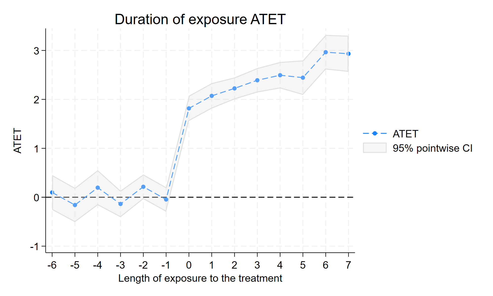
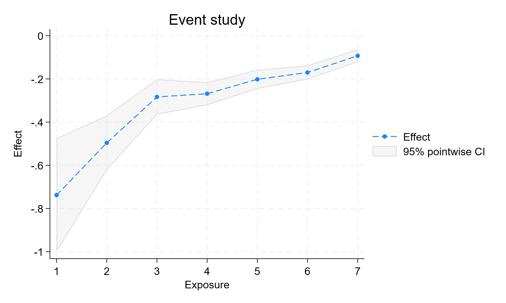

# 报告：吸收型 vs 可逆多值 DID 路由模拟

> 配套数据：`data/did-routing/absorbing_staggered.dta`、`switching_multivalued.dta`  
> 重建：`do data/did-routing/build_did_routing.do`（Stata 19.5，seed `20260928`）  
> 分析：`demo/dofiles/09_xtswitchdid_vs_xthdidregress.do`  
> 证据：`demo/logs/09_xtswitchdid_vs_xthdidregress.log` + `demo/output/09_*.png`  
> 路由速查：[`docs/learn-did-routing-absorbing-vs-switching.md`](../docs/learn-did-routing-absorbing-vs-switching.md)

本报告记录一次**可复现**的对照实验：同一套磁盘数据上，正确命令 vs 错误编码，给出本机 StataNow 19.5 实测数字与路由结论。

---

## 0. 摘要

| 场景 | 数据 | 正确命令 | 关键估计 | 反面结果 |
|---|---|---|---|---|
| A 吸收错时 | `absorbing_staggered`（N=4800） | `xthdidregress aipw` | overall ATET **2.334** | 同数据 `xtswitchdid`：`neffects(4)` total≈**2.150**；`neffects(8)`≈**2.349**（接近 AIPW；短窗差额主要来自暴露期截断） |
| B 多值可逆 | `switching_multivalued`（N=5000） | `xtswitchdid, neffects(7)` | total **−0.864**；paths 含 **44** 条 `0 1 1 1 2 2 2 0` | `treat_bin`→**r(498)**；`treat_abs` 能出数但**掩盖撤销**（非偷看未来） |

**结论：** 处理形态是选命令的**必要**条件，不是充分条件——还要能辩护目标参数、同初始处理水平的对照、平行趋势与无预期。吸收二元错时默认 `xthdidregress aipw`；离散可逆/多值默认 `xtswitchdid`，且 **`neffects` / `pathlen` 必须盖住撤销期**。把可逆处理二值化或「粘性 ever-treated」化硬套吸收命令，要么报错，要么估计错误对象。

---

## 1. 环境与复现

| 项目 | 详情 |
|---|---|
| Stata | StataNow 19.5 MP（revision ≥ 2026-07-29，含 `xtswitchdid`） |
| Seed | `20260928`（两份 `.dta` 各自独立重置 seed 生成） |
| 操作系统 | Windows 10 |
| 日志 | `demo/logs/09_xtswitchdid_vs_xthdidregress.log`（exit=0，含 `DONE_ROUTING_DEMO`） |

```stata
do "data/did-routing/build_did_routing.do"
do "demo/dofiles/09_xtswitchdid_vs_xthdidregress.do"
```

---

## 2. 数据设计

### 2.1 场景 A — `absorbing_staggered.dta`

- 400 县 × 12 年（2010–2021），N=4800  
- `cohort`：0 从未处理；1 自 2014 吸收开通；2 自 2017 吸收开通  
- `treat`：吸收型 0/1  
- DGP：开通后 ATT ≈ **2 + 0.15×暴露期**  
- 不变量：`treat==1` 观测 1040；`mean(treat)=0.2167`

### 2.2 场景 B — `switching_multivalued.dta`

- 250 县 × 20 年（2006–2025），N=5000  
- `dose` ∈ {0,1,2}；一类县（`mod(id,4)==1`）：2012→1，2015→2，**2018→0**（首次处理后第 **7** 个暴露期才撤销）  
- DGP：当期每单位 dose 效应 ≈ **−0.8**  
- 反面编码（主估计勿用）：  
  - `treat_bin = (dose>0)`：当期二值化  
  - `treat_abs = sum(dose>0)>0`：**截至当期曾处理则永久置 1**（撤销后仍为 1 的观测 **352**；首次处理前误标为 1 的观测 **0** → **不是偷看未来**）

Schema / DGP 全文见 `data/did-routing/README.md`。

---

## 3. 场景 A 实测：`xthdidregress aipw`

```stata
use "data/did-routing/absorbing_staggered.dta", clear
xtset id year
xthdidregress aipw (y) (treat), group(id)
estat aggregation, overall
estat aggregation, dynamic
estat ptrends
```

### 3.1 主结果

| 量 | 估计 | se | 说明 |
|---|---|---|---|
| Overall ATET | **2.334** | 0.106 | 贴近真值「2 + 动态」 |
| Exposure = 0 | **1.816** | 0.132 | 开通当年 |
| Exposure = 1 | **2.072** | 0.132 | 随后升高 |
| Exposure = 2 | **2.225** | 0.114 | 与 DGP 逐年略增一致 |
| `estat ptrends` | χ²(9)=12.85 | p=**0.170** | **未拒**事前平行趋势；未拒 ≠ 证明假设成立 |

Cohort 结构：never=2880，2014 cohort=960，2017 cohort=960。

### 3.2 事件研究图



### 3.3 对照：同数据 `xtswitchdid`（暴露期截断很要紧）

```stata
xtswitchdid (y) (treat), group(id) neffects(4)
estat total                                // ≈ 2.150

xtswitchdid (y) (treat), group(id) neffects(8)
estat total                                // ≈ 2.349  ← 接近 AIPW 2.334
```

| 设定 | `estat total` | 与 AIPW overall 2.334 |
|---|---|---|
| `neffects(4)` | **2.150** | 差约 0.18（短窗截断 + 参数定义不同） |
| `neffects(8)` | **2.349** | 几乎贴上 |

- Header：**Absorbing = Yes**  
- `xtswitchdid` 报告的是 **normalized exposure effects** 及其 `estat total`，不是 AIPW 的 ATET 表  
- **不要**把「2.150 vs 2.334」单独读成方法冲突；先对齐暴露期窗口  

**路由：** 论文若声称 ATET / 事件研究聚合 → 主路径仍是 `xthdidregress aipw`；`xtswitchdid` 最多作稳健性，且须写明 `neffects`。

---

## 4. 场景 B 实测：`xtswitchdid`（须盖住撤销）

```stata
use "data/did-routing/switching_multivalued.dta", clear
xtset id year
xtswitchdid (y x1) (dose), group(id) neffects(7)
estat ptrends
estat paths, pathlen(7)
estat total
estat eventplot
```

一类县 2018 年才回到 0，对应首次处理后第 7 个暴露期；**`neffects(3)` / 默认 `pathlen(3)` 看不到 `…2 2 2 0`**。

### 4.1 主结果（`neffects(7)`）

| 量 | 估计 | se | 说明 |
|---|---|---|---|
| Exposure 1（归一化） | **−0.738** | 0.134 | 累计剂量增量≈1 时，接近当期每单位 −0.8 |
| Exposure 2（归一化） | **−0.496** | 0.065 | **不能**直接说「第 2 期效应衰减到 −0.5」 |
| Exposure 3（归一化） | **−0.283** | 0.042 | 同上：分母是截至该暴露期的累计剂量变化 |
| … | … | … | Exposure 4–7 继续按累计增量归一化 |
| `estat total` | **−0.864** | 0.084 | 每单位处理的平均总效应（已含撤销窗） |
| `estat ptrends` | χ²(…) | p 未拒 | 安慰剂未拒 ≠ 证明平行趋势 |
| Header Absorbing | **No** | — | 明确非吸收 |

**归一化 exposure 怎么读：** `xtswitchdid` 的暴露期系数是按**截至该暴露期的累计处理增量**归一化后的效应（官方手册定义）。在本 DGP「每单位 dose 当期 −0.8」下，只有当累计增量≈1（典型为刚升一档的 Exposure 1）时，才适合与 −0.8 逐期对照；后续暴露期数值变小，主要反映分母变大，**不等于当期边际效应在衰减**。要汇报「每单位剂量」的汇总，优先看 **`estat total`**。

短窗对照（教学用）：`neffects(3)` 时 `estat total`≈**−0.853**，`estat paths, pathlen(3)` 只有 `0 1 1 1` / `0 2 2 2` 等，**没有**撤销路径。

### 4.2 路径分布（`estat paths, pathlen(7)`）

| Path | Freq | Percent |
|---|---|---|
| `0 1 1 1 1 1 1 1` | 43 | 34.96 |
| `0 1 1 1 2 2 2 0` | **44** | **35.77** |
| `0 2 2 2 2 2 2 2` | 22 | 17.89 |
| 其他（升档未撤等） | 14 | 11.38 |

`0 1 1 1 2 2 2 0` 即报告强调的一类县 **升档后再撤销**。

### 4.3 事件图



**路由：** 多值 + 可撤销 → **`xtswitchdid`**；设定 `neffects` / `pathlen` 时先数清最长有意义路径（本例 ≥7）。

---

## 5. 反面教材（必须保留）

### 5.1 `treat_bin` → `xthdidregress` → **r(498)**

```stata
xthdidregress aipw (y) (treat_bin), group(id)
```

```text
invalid treatment
The treatment is assumed to be staggered. Once a unit is treated,
it should remain treated.
r(498)
```

这是**设计信号**：可逆路径不能硬套吸收型 staggered 命令。

### 5.2 `treat_abs`（粘性 ever-treated）→ 能出数，但对象错了

```stata
* 生成式：bysort id (year): gen treat_abs = sum(dose>0) > 0
xthdidregress aipw (y) (treat_abs), group(id)
estat aggregation, overall
```

| 诊断 | 本数据 |
|---|---|
| 首次处理前 `treat_abs==1` | **0**（没有偷看未来） |
| `dose==0` 且 `treat_abs==1` | **352**（撤销后仍标处理） |
| overall ATET | ≈ **−1.013** |

- `_rc = 0` 只说明吸收型命令接受了这条「粘性」路径  
- 估计的不是「当期每单位 dose」；撤销段与剂量升降都被抹平  
- **能出系数 ≠ 识别正确**；错因是**掩盖撤销/剂量**，不是偷看未来  

---

## 6. 路由卡（投稿前）

处理形态只是第一步：

```text
1. 0/1 且永久开通 + 错时 → 候选 xthdidregress aipw
2. 多档或可撤销 → 候选 xtswitchdid（neffects/pathlen 盖住撤销）
3. 连续剂量 / HAD → did_multiplegt / did_had（社区包）
```

还须同时能辩护（手册要求的识别条件，缺一则不要宣称因果）：

- [ ] **目标参数**：ATET vs normalized exposure / `estat total` 写清楚  
- [ ] **对照**：存在同初始处理水平、在比较窗内保持该水平的单位  
- [ ] **平行趋势 + 无预期**：用 `estat ptrends` 等检查；**p 未拒绝 ≠ 假设已证明**  
- [ ] 处理编码与故事一致（吸收 vs 可逆；勿粘性 ever-treated）  
- [ ] 吸收错时主表是 AIPW + 动态聚合，不是 plain TWFE  
- [ ] 可逆/多值未二值化后硬套 hdid 系；若见 **r(498)**：改命令族  

---

## 7. 产物清单

| 文件 | 作用 |
|---|---|
| `data/did-routing/absorbing_staggered.dta` | 场景 A 面板 |
| `data/did-routing/switching_multivalued.dta` | 场景 B 面板 |
| `data/did-routing/build_did_routing.do` | 重建脚本 |
| `demo/dofiles/09_xtswitchdid_vs_xthdidregress.do` | 估计 + 出图 |
| `demo/logs/09_xtswitchdid_vs_xthdidregress.log` | 全量运行日志 |
| `demo/output/09_absorbing_xthdid_dynamic.png` | A 动态 ATET 图 |
| `demo/output/09_switching_xtswitchdid_event.png` | B 事件图 |
| `docs/learn-did-routing-absorbing-vs-switching.md` | 路由学习卡（精简版） |

---

*本报告数字与 `demo/logs/09_xtswitchdid_vs_xthdidregress.log` 同源；重跑以 log 为准。*
