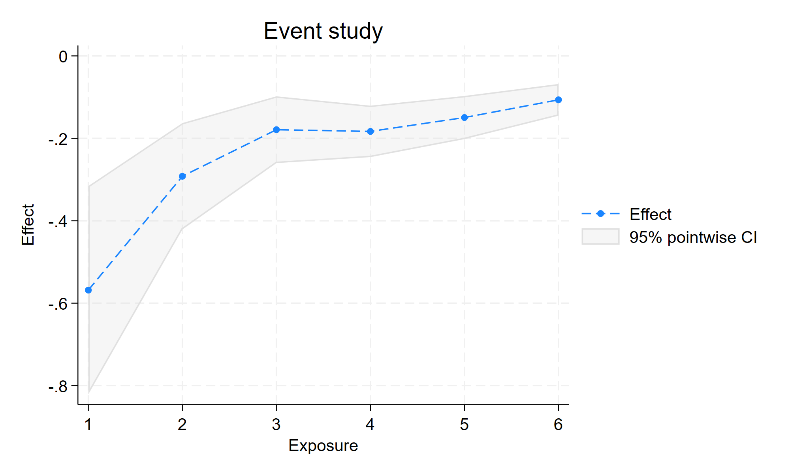

# 讲稿：`xtswitchdid` 选定之后还能怎么设

> 课型：方法论研讨课 · 承接「吸收 vs 可逆」路由课后  
> 数据：`data/did-routing/switching_features.dta`（seed `20260929`）  
> 演示：`demo/dofiles/10_xtswitchdid_features.do`  
> 证据：`demo/logs/10_xtswitchdid_features.log` · `demo/output/10_baseline_event.png`  
> 上一课：[`REPORT-09-xtswitchdid-routing.md`](REPORT-09-xtswitchdid-routing.md)（先学会**选谁**）

---

## 开场（约 3 分钟）

上一课我们解决的是：**该用 `xthdidregress` 还是 `xtswitchdid`**。  
这堂课假设你已经选对了 `xtswitchdid`——问题变成：

> 官方手册里那些选项，各自在回答什么实证问题？课堂上怎么讲清楚？

同一份数据、十个开关，全部本机跑通。真值：每单位 `dose` ≈ **−0.7**；2020 年结局故意缺失，用来讲非平衡面板。

**复现（课前或课后）：**

```stata
do "data/did-routing/build_switching_features.do"
do "demo/dofiles/10_xtswitchdid_features.do"
```

日志里应出现 `F1_OK` … `F10_OK` 和 `DONE_FEATURES_DEMO`。

---

## 课前一张图：这批县里有什么路径

| typ | 故事（课堂上可这样说） |
|---|---|
| 0 | 一直 0 档——干净对照 |
| 1 | 0→1→2，升上去不回头 |
| 2 | 0→2，后来又撤回 0 |
| 3 | **样本开始就是 1 档**，再升到 2 |
| 4 | 一直停在 1——给 typ3 当对照 |
| 5 | **样本开始就是 2 档**，再往下降 |
| 6 | 一直停在 2——给 typ5 当对照 |

280 县 × 16 年，嵌在 28 个省里。处理是离散档 `dose∈{0,1,2}`，不是「开/关」二元。

**板书一句：** `xtswitchdid` 只在**同一初始档**的组之间比；所以 typ3 跟 typ4 比，typ5 跟 typ6 比——不是跟「从未有过任何政策」的人乱比。

---

## 第 1 节 · 基线：多值可切换（F1）

**要讲的问题：**  
评级、规制条数这种「有几档、还能改」——传统 ATET 命令不够用时，事件研究怎么估？

```stata
xtset id year
xtswitchdid (y x1) (dose), group(id) neffects(6)
estat ptrends
estat total
estat eventplot
```

**本例数字（对着 log 念）：**

| 量 | 估计 | 课堂上怎么说 |
|---|---|---|
| Exposure 1（归一化） | −0.57 | 刚偏离初始档、累计增量大约 1 档时，接近真值 −0.7 |
| `estat total` | **−0.58** | 汇报「每单位剂量」优先看这个 |
| `estat ptrends` | p=0.23 | **未拒绝**安慰剂联合检验；未拒 ≠ 已证明平行趋势 |



**口头强调（必讲）：**  
后面 Exposure 2、3… 数字变小，**主要是归一化分母变大**，不能说成「政策效果一年比一年差」。要讲「每单位」，看 `estat total`。

---

## 第 2 节 · 样本一开始就不在 0（F2）

**要讲的问题：**  
很多政策研究打开数据——县里「历来就有一档补贴」。是不是必须砍成「从零起步」才能做 DID？

**答：不必。** 手册写明 groups need not be first observed at 0。

```stata
keep if inlist(typ, 3, 4)   // 初始都是 1
xtswitchdid (y x1) (dose), group(id) neffects(4)
estat total                 // 本例 −0.73
```

**课堂上的对比句：**  
我们问的不是「有没有政策」，而是「相对继续停在 1 档，升到 2 档差多少」。

---

## 第 3 节 · 只要升档 / 只要降档（F3 / F4）

**要讲的问题：**  
审稿人问：效应是「加码」带来的，还是「松绑」带来的？能不能分开看？

```stata
* 只要首次切换是向上
xtswitchdid (y x1) (dose), group(id) neffects(5) switchgroup(in)
estat total    // 本例 −0.69

* 只要首次切换是向下
xtswitchdid (y x1) (dose), group(id) neffects(5) switchgroup(out)
estat total    // 本例 −0.12（se 大）
```

**怎么讲数字：**

- F3 升档：样本够，total 贴近 −0.7，好讲。  
- F4 降档：命令**能跑**，但本例 switch-out 县更少，se 大、点估计偏弱——正好教学生：**选项打开了 ≠ 效力够**；先看 Header 里 Switch out 的组数。

**理论一句（可板书）：**  
命令在聚合时假定「升一档」与「降一档」效应符号相反，再平均；所以分开估 `in` / `out` 往往更干净。

---

## 第 4 节 · 对照只用「从未切换」（F5）

**要讲的问题：**  
默认对照里既有「永远不改档」的人，也有「以后才会改、眼下还没改」的人（not-yet）。想更干净时怎么办？

```stata
xtswitchdid (y x1) (dose), group(id) neffects(5) controlgroup(never)
estat total    // 本例 −0.60
```

**课堂上的取舍：**  
`never` 更干净，但对照变少、标准误常变大。先写清你用的是哪一种对照池。

---

## 第 5 节 · 路径特定效应（F6）

**要讲的问题：**  
平均效应把很多路径揉在一起。你其实只关心「0→1→1→1→2→2」这种故事怎么办？

```stata
quietly xtswitchdid (y x1) (dose), group(id) neffects(6)
estat paths, pathlen(6) generate(featpath)
xtswitchdid (y x1) (dose), group(id) path(featpath1) neffects(5)
estat total    // 本例路径 0 1 1 1 2 2，total −0.71
```

**教法建议：**  
先投 `estat paths` 频数表，让学生指一条「够厚」的路径，再 `path()`。路径太碎会没观测——这是数据限制，不是命令坏了。

---

## 第 6 节 · 只在省内比（F7）

**要讲的问题：**  
县域政策，用外省当对照是否合理？想强制「只跟本省、同初始档的县比」？

```stata
xtswitchdid (y x1) (dose), group(id) supergroup(province) neffects(5)
estat total    // 本例 −0.56
```

**故事化：**  
`group(id)` 是处理发生的层；`supergroup(province)` 是「比较不许跨出的围栏」。

---

## 第 7 节 · 归一化还是 raw（F8）

**要讲的问题：**  
表里 Exposure 系数越往后越小——是效应在消，还是分母在变？

```stata
xtswitchdid (y x1) (dose), group(id) neffects(4)        // 默认 normalized
xtswitchdid (y x1) (dose), group(id) neffects(4) raw    // 未归一化
```

**本例：** 两种设定下 `estat total` 都是 **−0.59**（每单位汇总不变）；变的是暴露期那一列表头与数值含义。

**口令：**  
主文报告 normalized + `estat total`；附录可给 `raw`。千万别把后期归一化系数直接对照 DGP 的「当期 −0.7」。

---

## 第 8 节 · 长短窗用同一批人（F9）

**要讲的问题：**  
短暴露期用了 200 个 switcher，长暴露期只剩 40 个——曲线形状是效应，还是样本构成在变？

```stata
xtswitchdid (y x1) (dose), group(id) neffects(5) commonswitchers
estat total    // 本例 −0.60
```

**课堂上的类比：**  
事件研究图要「同一群人走完全程」，才好谈动态；否则先说明构成漂移。

---

## 第 9 节 · 非平衡与隔年调查（F10）

**要讲的问题：**  
CFPS、县域年鉴经常隔年；疫情年整列缺失——是不是就不能用面板 DID？

1. **非平衡：** 本数据 2020 年 `y` 全缺，F1 照样估得出（log 里 N=4200 < 4480）。  
2. **隔年：**

```stata
keep if mod(year, 2)==0
xtset id year, delta(2)
xtswitchdid (y x1) (dose), group(id) neffects(4)
estat total    // 本例 −0.57
```

**板书：** 时间步长写进 `xtset, delta(#)`，不要假装每年都有观测。

---

## 收束：十个开关一张卡（投屏用）

| 你想回答的问题 | 拧哪个开关 | 本课 total |
|---|---|---|
| 多值可切换的平均每单位效应 | 基线 `xtswitchdid` | −0.58 |
| 历来就不在 0 档 | 限制同初始档子样本 | −0.73 |
| 只要加码 / 只要松绑 | `switchgroup(in\|out)` | −0.69 / −0.12 |
| 对照只要永不切换 | `controlgroup(never)` | −0.60 |
| 某一条具体路径 | `estat paths` + `path()` | −0.71 |
| 只在省内比 | `supergroup()` | −0.56 |
| 系数别被剂量归一化「看矮」 | 对照看 `raw`；汇报仍靠 total | −0.59 |
| 动态图要同批人 | `commonswitchers` | −0.60 |
| 隔年 / 缺年 | `delta()`；非平衡直接估 | −0.57 |

**三句收尾（建议原样留给学生）：**

1. 先路由（REPORT-09）：吸收 → `xthdidregress`；离散可逆 → `xtswitchdid`。  
2. 再选型（本讲稿）：in/out、对照池、路径、超组、归一化、样本构成、时间步长——**每个选项对应一个识别/样本决策**。  
3. 连续剂量 / HAD 仍不在这里 → `did_multiplegt` / `did_had`。

---

## 作业建议（可选）

1. 把 F4 的 switch-out 县加倍（改 `build_switching_features.do`），看 total 是否靠近 −0.7。  
2. 在 `estat paths` 里另选一条低频路径，解释为什么 `path()` 会失败或 se 爆炸。  
3. 用一句话区分：normalized Exposure ℓ 与 `estat total`。

---

## 附录 · 材料索引

| 文件 | 用途 |
|---|---|
| `data/did-routing/switching_features.dta` | 本课面板 |
| `data/did-routing/build_switching_features.do` | 重建 |
| `demo/dofiles/10_xtswitchdid_features.do` | 课堂演示脚本 |
| `demo/logs/10_xtswitchdid_features.log` | 全量数字 |
| `stata-did/references/xtswitchdid.md` | 语法详签 |
| REPORT-09 | 路由课（选命令） |

*讲稿中的估计值以 `demo/logs/10_xtswitchdid_features.log` 为准；重跑后若有漂移，以新 log 更新本页数字表。*
