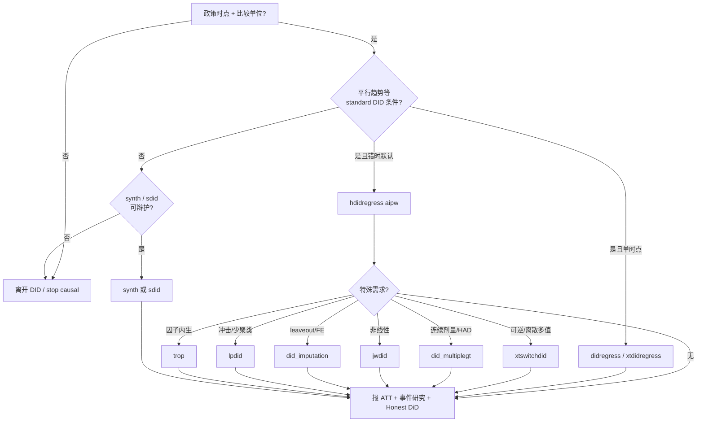

# 学习指南：本仓库的 DID 前沿方法

> 面向：想在本仓库里把「现代 DID」从概念串到可执行命令的人。  
> 依据：`stata-did` / `stata-did-community` / `stata-identification` 的强制路径与决策树；外加 AnySearch（学术 preprint）与 agent-reach / Exa 检索到的 2023–2026 综述与实践指南。  
> 检索时点：2026-09-28。

---

## 1. 先抓住主线

近十年 DID 方法学的核心不是「多跑几个回归」，而是：

1. **先定目标参数**（ATT / ATT(g,t) / 事件研究 ATT_es(e)），再选估计量（Baker et al. 2025/2026 的 *forward-engineering*）。
2. **错时（staggered）下 plain TWFE 会混入负权重**，不能当默认主结果。
3. **平行趋势不可证明**：pre-trend 不显著 ≠ PT 成立；需要敏感性（Honest DiD）而不是只报 `estat ptrends` 的 p 值。
4. **按数据特征选估计量**，不是「哪个最新用哪个」。

本仓库把这条主线拆成两层 skill + 一个识别路由：

| 层 | Skill | 角色 |
|---|---|---|
| 官方内置 | `stata-did` | `didregress` / `xtdidregress` / `hdidregress` / `xthdidregress` / **`xtswitchdid`**（可逆·离散多值） |
| 社区前沿 | `stata-did-community` | CS / ETWFE / BJS / synth / sdid / DCDH / stacked / lpdid / TROP … |
| 识别入口 | `stata-identification` | 面板政策公共 gate → 4a standard DID / 4b synth·sdid |

**默认吸收错时主路径**：回 `stata-did` 跑 `hdidregress aipw`（或面板版 `xthdidregress aipw`）。  
**默认可逆/离散多值**：`stata-did` 的 `xtswitchdid`（StataNow revision ≥ 2026-07-29）。不要默认把十个社区包全跑一遍。

---

## 2. 仓库地图（读什么、按什么顺序）

```text
识别是否该做 DID
  └─ stata-identification/references/identification-decision-tree.md
       ├─ 公共 gate 失败 → 离开 DID（selection / stop causal）
       ├─ 4a standard DID → stata-did
       └─ 4a 失败 → 4b synth / sdid → stata-did-community

做估计
  ├─ 简单 2×2 / 默认错时 → stata-did/SKILL.md
  └─ 特殊设计（可逆、连续剂量、少数单位、冲击型…）
        → stata-did-community/SKILL.md（决策树命中即停）
        → references/<method>.md（签名与工作流）

完整研究项目串起来
  └─ stata-did-community/references/workflow-8step.md
```

| 你想学的内容 | 文件 |
|---|---|
| 内置 DID / DDD / wild bootstrap / bdecomp / **xtswitchdid** | `stata-did/SKILL.md` + `stata-did/references/xtswitchdid.md` |
| **吸收 vs 可逆 模拟路由**（`xthdidregress` ↔ `xtswitchdid`） | [`docs/learn-did-routing-absorbing-vs-switching.md`](learn-did-routing-absorbing-vs-switching.md) · 报告 [`demo/REPORT-09-xtswitchdid-routing.md`](../demo/REPORT-09-xtswitchdid-routing.md) · `demo/dofiles/09_*.do` |
| **`xtswitchdid` 功能点讲稿**（in/out/path/supergroup/raw/…） | [`demo/REPORT-10-xtswitchdid-features.md`](../demo/REPORT-10-xtswitchdid-features.md) · `demo/dofiles/10_xtswitchdid_features.do` · `data/did-routing/switching_features.dta` |
| 方法选择决策树 + 特征矩阵 + 陷阱 | `stata-did-community/SKILL.md` |
| CS / jwdid / BJS 三件套 | `stata-did-community/references/csdid-jwdid-imputation.md` |
| 合成控制 / 合成 DID | `references/synth.md`、`references/sdid.md` |
| 连续剂量 / HAD / did_had（社区对照） | `references/dcdh.md` |
| 堆叠 DID + TWFE 权重诊断 | `references/stacked.md` |
| 局部投影 DID（冲击型、少聚类） | `references/lpdid.md` |
| 高维共同因子 TROP | `references/trop.md` |
| Baker 八步工作流 | `references/workflow-8step.md` |
| 平行趋势敏感性（Honest DiD） | workflow-8step 步骤 6；OVB 类敏感性另见 `stata-identification/references/sensitivity-analysis.md` |

---

## 3. 方法学地图：前沿在解决什么问题

Roth, Sant’Anna, Bilinski & Poe (2023) 把近年文献收成三条放松：

| 放松什么 | 代表问题 | 本仓库落点 |
|---|---|---|
| 处理时点与赋值 | 错时、可逆、非二元、无 stayer、universal dose | `hdidregress` / `csdid` / `jwdid` / `did_imputation` / `did_multiplegt` / `did_had` / `lpdid` |
| 平行趋势可能失败 | pre-test 低功效、pretest bias、需要稳健 CI | Roth (2022) 警示；`honestdid`；合成分支 `synth`/`sdid`；因子 `trop` |
| 推断假设 | 少聚类、少处理单位 | `wildbootstrap` / `aggregate(dlang)` / `lpdid bootstrap` / `synth_runner` placebo |

Baker, Callaway, Cunningham, Goodman-Bacon & Sant’Anna（JEL 2026；arXiv:2503.13323）把实践压成一句话：

> 复杂 DID = 一堆干净的 2×2「积木」再聚合；先定参数，再选积木，不要从 TWFE 规格反推因果含义。

---

## 4. 场景 → 命令速查（与仓库决策树一致）

自上而下，**命中即停**。

| 场景 | 推荐 | Skill / 文件 |
|---|---|---|
| 单时点 × 重复截面 / 面板 | `didregress` / `xtdidregress` | `stata-did` |
| 错时，无特殊需求（默认） | `hdidregress aipw` / `xthdidregress aipw` | `stata-did` |
| 可逆 / 离散多值 / switching | `xtswitchdid` | `stata-did` · [references/xtswitchdid.md](../stata-did/references/xtswitchdid.md) |
| 错时 + DR/IPW/Reg 对照 | `csdid method(dr)` | community · csdid |
| 错时 + 计数/二元结果 | `jwdid … method(poisson\|logit) group` | community · jwdid |
| 错时 + leaveout / 灵活 FE / 单位趋势 | `did_imputation … leaveout` | community · BJS |
| 论文要 Sun–Abraham 风格事件研究 | `csdid method(dr)` + `estat event`（与 SA-IW 在共同支撑下渐近等价） | community · csdid |
| 连续剂量 / 点名 DCDH / 无 xtswitchdid | `did_multiplegt (dyn)` | community · dcdh |
| 0/1 + 无 stayer + 有 quasi-stayer | `did_multiplegt (had)` | community · dcdh |
| 全体都有正剂量（universal policy） | `did_had`（边界识别；**不是** had 的升级版） | community · dcdh |
| 少数处理单位 + 长前期 + donor | `synth` + placebo | community · synth |
| 充分前后期 + 合成 DID | `sdid` | community · sdid |
| 冲击型（只 1 期）或聚类 < 50 | `lpdid`（可加 `bootstrap`） | community · lpdid |
| TWFE 权重诊断 / 超大数据 | `stacked` | community · stacked |
| 高维共同因子 + 处理与因子相关 | `trop` | community · trop |
| 分数线 / 年龄门槛 / 地理边界 | **踢走** `stata-rdd` | 不是 DID |

编码契约（极易混）：

- `csdid` / `jwdid` 的 never-treated：`gvar` 用 `0` 或 `.`
- `did_imputation` 的 `Ei`：**必须是 `.`，不能是 `0`**

---

## 5. 建议学习路径（约 4–6 个会话）

### 第 1 课：问题从哪里来（1–2 小时）

1. 读 Roth et al. (2023) 综述的 checklist：同时间处理 → TWFE 往往够；错时 → 异质性稳健估计量。  
   - 开放 PDF：https://www.alyssabilinski.com/assets/pdf/2023_roth_trending_did_econometrics.pdf  
2. 对照仓库：`stata-did/SKILL.md` 强制路径 + 第 5–7 节（`hdidregress`、`estat aggregation`、`estat bdecomp`）。  
3. 自检：你能不能用一句话说清「错时 TWFE 负权重」为何出现？说不清就先跑一遍 `estat bdecomp` 诊断示例。

### 第 2 课：默认错时主路径（动手）

```stata
version 19.5
xtset id t
xthdidregress aipw (y) (treat), group(id)
estat aggregation, dynamic graph
estat atetplot
```

对照：`estat ptrends` 在 staggered 下检验的是加总 pre 系数，**不等于** cohort 级 pre-trend。正确看 CS/SA 事件研究的 e<0 联合检验（`csdid` → `estat event`）。见 Roth (2022) *Pretest with Caution*。

### 第 3 课：三大社区错时估计量（按需深入）

读 `references/csdid-jwdid-imputation.md`，只挑与你数据匹配的一条：

| 需求 | 命令 |
|---|---|
| 三方法对照 | `csdid … method(dr)` |
| 非线性 | `jwdid … method(poisson) group` |
| leaveout / 灵活 FE | `did_imputation … leaveout` |

验证：`bash verify/run-verify.sh did-community`（已装包）或 `--community`（强制真跑）。

### 第 4 课：特殊设计分支

按你的真实设计只读一个 references：

- 可逆 / 连续 / HAD → `dcdh.md`（注意 `did_had` 与 `(had)` **估计不同参数**）
- 极少处理单位 → `synth.md`（必须 placebo）
- PT 可疑但仍想留在面板政策 → `sdid.md` 或 `trop.md`
- 冲击 / 少聚类 → `lpdid.md`

### 第 5 课：整条研究流水线

跟 `workflow-8step.md` 走完八步：目标参数 → 假设 → PT 诊断 → 选估计量 → 聚类/推断 → **Honest DiD** → 异质性 → 2–3 个估计量稳健性。  
投稿前功效：同文件步骤 5b + `references/power-analysis-template.do`。

### 第 6 课（可选）：识别边界

若「这还是不是 DID」都说不清：读 `identification-decision-tree.md` 的 4 / 4a / 4b。分数线类问题一律踢走 RDD。

---

## 6. 核心文献（按阅读优先级）

### 必读综述与实践指南

| 文献 | 为何读 | 链接 |
|---|---|---|
| Roth, Sant’Anna, Bilinski & Poe (2023) | 近年 DID 地图 + practitioner checklist | [JoE](https://doi.org/10.1016/j.jeconom.2023.03.008) · [PDF](https://www.alyssabilinski.com/assets/pdf/2023_roth_trending_did_econometrics.pdf) |
| Baker, Callaway, Cunningham, Goodman-Bacon & Sant’Anna (JEL 2026) | 2×2 积木框架；权重 / 协变量 / 错时 | [JEL](https://www.aeaweb.org/articles?id=10.1257/jel.20251650) · [arXiv](https://arxiv.org/abs/2503.13323) · [作者 PDF](https://psantanna.com/files/DiD_JEL.pdf) |
| Roth (2022) | Pre-test 不能证明 PT | *AER: Insights* |
| Rambachan & Roth (2023) | Honest DiD 敏感性 | [RESTUD](https://www.jonathandroth.com/assets/files/HonestParallelTrends_Main.pdf) · Stata: `ssc install honestdid` |

### 错时异质性稳健（「新三件套」）

| 文献 | 估计量族 | 本仓库命令 |
|---|---|---|
| Callaway & Sant’Anna (2021) | group-time ATT + 聚合 | `csdid` / `hdidregress aipw` |
| Sun & Abraham (2021) | interaction-weighted 事件研究 | 实务上常用 `csdid` 事件研究（仓库说明与 SA-IW 渐近等价） |
| Borusyak, Jaravel & Spiess (2024) | 插补法 | `did_imputation` |
| Wooldridge ETWFE | 回归 / 非线性 | `jwdid` |
| Goodman-Bacon (2021) | TWFE 分解直觉 | 诊断用 `estat bdecomp` / stacked |

### 扩展设计（本仓库已路由）

| 文献 | 场景 | 命令 |
|---|---|---|
| Arkhangelsky et al. (2021) AER | 合成 DID | `sdid`（见 Clarke et al. *Stata Journal* 实现综述） |
| Abadie et al.；ADH 2015 | 合成控制 + 置换推断 | `synth` + `synth_runner` |
| de Chaisemartin & D’Haultfœuille 系列 | 可逆 / 多值 / 动态 | **`xtswitchdid`**（官方）或 `did_multiplegt (dyn)`（社区 / 连续剂量） |
| de Chaisemartin et al. (2025) | 无 untreated 的剂量设计 | `did_had` |
| Athey, Imbens, Qu & Viviano (2025/2026) | 三重稳健面板 | `trop` · [arXiv:2508.21536](https://arxiv.org/abs/2508.21536) · [JAE](https://onlinelibrary.wiley.com/doi/10.1002/jae.70061) |
| Dube / Girardi 等 LP-DiD | 局部投影事件研究 | `lpdid` |

### 实操仓库（跨语言对照）

- [igerber/diff-diff](https://github.com/igerber/diff-diff) — 八步工作流与估计量选择（本仓库 `workflow-8step.md` 的同源思路）  
- [jonathandroth/did-resources](https://jonathandroth.github.io/did-resources/) — Honest DiD / pre-trends 资源索引  

---

## 7. 验证与「哪些还没跑过估计」

| 状态 | 内容 |
|---|---|
| 有 verify 覆盖（装包后可 `--community`） | `csdid` / `jwdid` / `did_imputation` / `synth` / `sdid`（见 `verify/verify-synth-sdid.do` 等） |
| 文档路由、签名齐全，但未纳入 estimate 回归 | `did_multiplegt` / `stacked` / `lpdid` / `did_had`（`did_had` 仅 `cap which`） |
| TROP | 有 `verify/verify-trop.do`；按 community 契约 optional |

原则（AGENTS.md）：**没验证过的语法不要当「已实测」写进论文主结果**；社区包先 `which`，再估计。

常用命令：

```bash
bash verify/run-verify.sh did              # 内置 DID
bash verify/run-verify.sh did-community    # 社区包（缺包装 silent PASS）
bash verify/run-verify.sh did-community --community   # 强制真跑
```

---

## 8. 常见误区（压缩版）

1. **错时仍报 plain TWFE 当主结果** → 改 `hdidregress aipw`。  
2. **`estat ptrends` p>0.05 就宣称 PT** → 错；看事件研究 pre 系数 + Honest DiD。  
3. **十个社区包当稳健性** → 决策树只跑命中的一条。  
4. **`did_had` 当 `(had)` 升级版** → 参数与假设都不同，按剂量/QUG 分叉。  
5. **`synth` 只报点估计** → 必须 placebo / 置换推断。  
6. **分数线改成 DID** → 踢走 `stata-rdd`。  
7. **混淆 never-treated 编码** → `csdid`/`jwdid` vs `did_imputation` 的 `0` / `.` 规则相反。

完整陷阱四件套见 `stata-did-community/SKILL.md`「关键陷阱速查」。

---

## 9. 一张总览图



---

## 10. 检索备注（本次文档来源）

- **AnySearch**：`C:\Users\jefeer\.skills-manager\skills\anysearch`；`academic.preprint` 对 Baker (2025/26)、TROP (2025) 命中良好；`academic.search` 对部分计量关键词召回偏噪，关键综述以 DOI / 作者页 / Exa 交叉确认。  
- **agent-reach / Exa**：Roth 2023 综述、Baker JEL 实践指南、HonestDiD 包、`did_had`、TROP arXiv/JAE、diff-diff 八步文档。  
- **Agent Reach**：本机 v1.5.0，已是最新。

---

## 11. 下一步（可选）

若你希望把学习变成可检查产出，建议任选其一：

1. 用自己的面板写一页「目标参数 + 识别假设 + 命中决策树的一条命令链」；  
2. 在装好社区包的机器上跑 `bash verify/run-verify.sh did-community --community`，对照 log 读事件研究输出；  
3. 指定一个真实政策设计，我按决策树帮你落到**唯一**命令链并对照 references 写最小 do-file。
