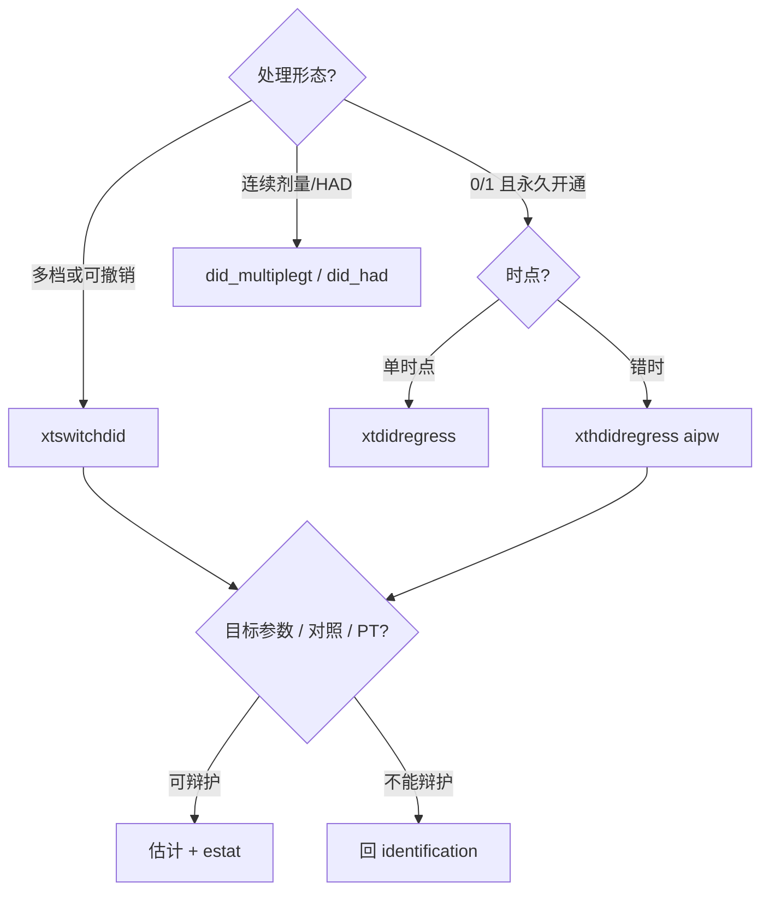

# 实证路由：`xthdidregress` vs `xtswitchdid`

> **完整实测报告（表 + 图 + log）：** [`demo/REPORT-09-xtswitchdid-routing.md`](../demo/REPORT-09-xtswitchdid-routing.md)  
> **数据（已生成）：** `data/did-routing/absorbing_staggered.dta`、`switching_multivalued.dta`  
> **重建：** `do data/did-routing/build_did_routing.do`（seed `20260928`，Stata 19.5）  
> **分析：** `demo/dofiles/09_xtswitchdid_vs_xthdidregress.do`（先 `use` 上述 `.dta`，再估计）  
> 本机 StataNow 19.5 实测数字。

---

## 先看结论（路由卡）

问自己的问题，按序停——**处理形态必要但不充分**：

```text
1. 处理是不是「一旦开通就不再撤销」的 0/1？
   └─ 是，且错时开通 → 候选 xthdidregress aipw（或 hdidregress aipw）
2. 处理会升降档、可撤销，或本来就是 0/1/2/… 多档？
   └─ 是 → 候选 xtswitchdid（neffects/pathlen 须盖住撤销期）
3. 剂量是连续实数 / 无 untreated 的 HAD？
   └─ 是 → 踢出本对照，走 did_multiplegt / did_had（社区包）

无论走哪条，还要能辩护：
  · 目标参数（ATET vs normalized exposure / estat total）
  · 同初始处理水平的可用对照
  · 平行趋势与无预期（estat ptrends 未拒 ≠ 已证明）
```

| 设计特征 | 用谁 | 不要做什么 |
|---|---|---|
| 二元 + **吸收** + 错时 | `xthdidregress aipw` | 不要默认 TWFE；对照 `xtswitchdid` 时写明 `neffects` |
| 离散多值 / **可逆** | `xtswitchdid` | 不要二值化后硬套 `xthdidregress`；不要短窗漏掉撤销 |
| 连续剂量 / HAD | `did_multiplegt` 等 | 不要假装 `xtswitchdid` 已覆盖 |

---

## 场景 A：医保试点永久开通（吸收型错时）

### 数据

```stata
use "data/did-routing/absorbing_staggered.dta", clear
* N=4800（400 县 × 12 年）；cohort 0/1/2；treat 吸收
```

部分县 2014 年开通、部分 2017 年开通；**一旦开通永不撤销**。  
DGP：开通后当期效应约 **2.0**，之后随暴露期略增。

### 正确命令

```stata
xtset id year
xthdidregress aipw (y) (treat), group(id)
estat aggregation, overall
estat aggregation, dynamic
estat ptrends
```

### 实测结果（摘要）

| 量 | 估计 | 说明 |
|---|---|---|
| Overall ATET | **2.33**（se 0.11） | 贴近真值 2+ 动态 |
| Exposure = 0（开通当年） | **1.82** | 事件研究起点 |
| Exposure = 1… | 约 2.07 → 升高 | 与 DGP「逐年略增」一致 |
| `estat ptrends` | χ²(9)=12.85，p=**0.17** | 未拒；未拒 ≠ 证明 |

**解读：** 吸收型二元错时，目标是 ATET / 事件研究聚合 → **`xthdidregress aipw` 是默认主路径**。

### 对照：同一数据上跑 `xtswitchdid`

也能跑通（Absorbing=Yes）。**暴露期截断会明显拉动 `estat total`：**

| `neffects` | `estat total` |
|---|---|
| 4（短窗） | ≈ **2.15** |
| 8（盖住最长暴露） | ≈ **2.35**（接近 AIPW 2.33） |

两种估计量定义仍不同（normalized exposure vs AIPW ATET）；不要把短窗差额单独说成方法冲突。

**路由：** 吸收二元错时 → **优先 `xthdidregress`**。

---

## 场景 B：环保限产等级可升降（多值 + 可逆）

### 数据

```stata
use "data/did-routing/switching_multivalued.dta", clear
* N=5000；dose∈{0,1,2}；一类县 2018 撤销 = 首次处理后第 7 暴露期
```

- 一类县：2012→1，2015→2，**2018 降回 0**  
- 二类 / 三类：升档后保持  

DGP：`y = 10 - 0.8·dose + …`（**当期**每单位 dose ≈ **−0.8**）。

### 正确命令

```stata
xtset id year
xtswitchdid (y x1) (dose), group(id) neffects(7)
estat ptrends
estat paths, pathlen(7)
estat total
estat eventplot
```

`neffects(3)` 时 paths 看不到 `0 1 1 1 2 2 2 0`；主结果用 **7**。

### 实测结果（摘要）

| 量 | 估计 | 说明 |
|---|---|---|
| Exposure 1（归一化） | **−0.74** | 累计增量≈1 时可对照 −0.8 |
| Exposure 2–3（归一化） | −0.50、−0.28 | **按累计剂量归一化**；变小 ≠ 当期效应衰减 |
| `estat total`（`neffects(7)`） | **−0.86** | 每单位处理总效应（含撤销窗） |
| `estat paths` | 含 **44** 条 `…2 2 2 0` | 撤销路径 |
| Header Absorbing | **No** | 明确非吸收 |

**解读：** 多值 + 可撤销 → **`xtswitchdid`**；汇报「每单位剂量」看 `estat total`，不要把后期归一化系数误读成 DGP 衰减。

### 反面教材 1：`treat_bin` → `xthdidregress` → r(498)

```stata
xthdidregress aipw (y) (treat_bin), group(id)
```

可逆路径不被吸收型 staggered 命令接受。

### 反面教材 2：`treat_abs` 粘性 ever-treated（**不是**偷看未来）

```stata
* bysort id (year): gen treat_abs = sum(dose>0) > 0
xthdidregress aipw (y) (treat_abs), group(id)   // 能出数；overall ≈ −1.01
```

- 首次处理前误标为 1：**0**  
- 撤销后仍为 1：**352**  
- 错因：掩盖撤销与剂量变化，不是偷看未来  

**路由：** 可逆 / 多值 → **必须 `xtswitchdid`**；二值化 / 粘性吸收化不是捷径。

---

## 一张图看清差异



---

## 实证检查清单（投稿前）

- [ ] 处理变量：吸收二元？还是多值/可逆？编码是否与故事一致  
- [ ] 目标参数、同初始水平对照、平行趋势/无预期能否辩护（`ptrends` 未拒 ≠ 已证明）  
- [ ] 吸收错时：主表是 `xthdidregress aipw` + 动态聚合，不是 plain TWFE  
- [ ] 可逆/多值：主表是 `xtswitchdid`；`neffects`/`pathlen` 盖住撤销；未二值化硬套 hdid  
- [ ] 若曾试 `xthdidregress` 报 **r(498)**：这是设计信号  
- [ ] 不要把粘性 `treat_abs` 误写成「偷看未来」；也不要用它当主处理  

---

## 如何复现

```stata
do "data/did-routing/build_did_routing.do"
do "demo/dofiles/09_xtswitchdid_vs_xthdidregress.do"
```

数据说明：`data/did-routing/README.md`（已登记 `data/manifest-extra.txt`）。  
详签：`stata-did/SKILL.md` 第 6 / 6b 节；`stata-did/references/xtswitchdid.md`。  
更大方法地图：`docs/learn-did-frontier.md`。
