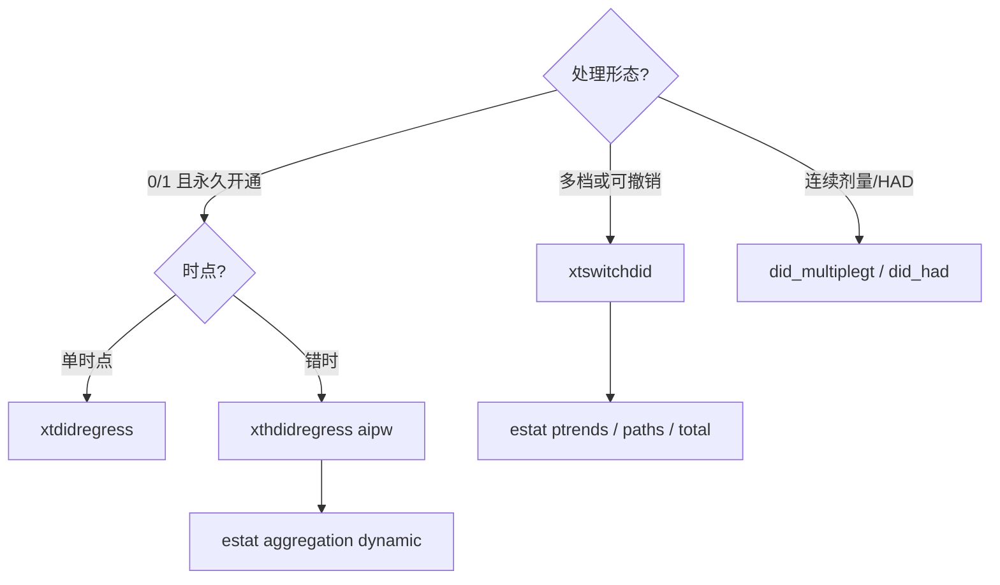

# 实证路由：`xthdidregress` vs `xtswitchdid`

> **完整实测报告（表 + 图 + log）：** [`demo/REPORT-09-xtswitchdid-routing.md`](../demo/REPORT-09-xtswitchdid-routing.md)  
> **数据（已生成）：** `data/did-routing/absorbing_staggered.dta`、`switching_multivalued.dta`  
> **重建：** `do data/did-routing/build_did_routing.do`（seed `20260928`，Stata 19.5）  
> **分析：** `demo/dofiles/09_xtswitchdid_vs_xthdidregress.do`（先 `use` 上述 `.dta`，再估计）  
> 本机 StataNow 19.5 实测数字。

---

## 先看结论（路由卡）

问自己三个问题，按序停：

```text
1. 处理是不是「一旦开通就不再撤销」的 0/1？
   └─ 是，且错时开通 → xthdidregress aipw（或 hdidregress aipw）
2. 处理会升降档、可撤销，或本来就是 0/1/2/… 多档？
   └─ 是 → xtswitchdid
3. 剂量是连续实数 / 无 untreated 的 HAD？
   └─ 是 → 踢出本对照，走 did_multiplegt / did_had（社区包）
```

| 设计特征 | 用谁 | 不要做什么 |
|---|---|---|
| 二元 + **吸收** + 错时 | `xthdidregress aipw` | 不要默认 TWFE |
| 离散多值 / **可逆** | `xtswitchdid` | 不要二值化后硬套 `xthdidregress` |
| 连续剂量 / HAD | `did_multiplegt` 等 | 不要假装 `xtswitchdid` 已覆盖 |

---

## 场景 A：医保试点永久开通（吸收型错时）

### 数据

```stata
use "data/did-routing/absorbing_staggered.dta", clear
* N=4800（400 县 × 12 年）；cohort 0/1/2；treat 吸收
```

部分县 2014 年开通、部分 2017 年开通；**一旦开通永不撤销**。  
DGP：开通后当期效应约 **2.0**，之后随暴露期略增。

### 正确命令

```stata
xtset id year
xthdidregress aipw (y) (treat), group(id)
estat aggregation, overall
estat aggregation, dynamic
estat ptrends
```

### 实测结果（摘要）

| 量 | 估计 | 说明 |
|---|---|---|
| Overall ATET | **2.33**（se 0.11） | 贴近真值 2+ 动态 |
| Exposure = 0（开通当年） | **1.82** | 事件研究起点 |
| Exposure = 1… | 约 2.07 → 升高 | 与 DGP「逐年略增」一致 |
| `estat ptrends` | χ²(9)=12.85，p=**0.17** | 未拒事前平行趋势 |

**解读：** 吸收型二元错时，目标是 ATET / 事件研究聚合 → **`xthdidregress aipw` 是默认主路径**。

### 对照：同一数据上跑 `xtswitchdid`

也能跑通（header 显示 Absorbing=Yes），`estat total`≈**2.15**。  
但报告的是 **normalized exposure effects**，不是 AIPW 的 ATET 表；论文若声称 ATET，仍应以 `xthdidregress` 为主、`xtswitchdid` 最多作稳健性。

**路由：** 吸收二元错时 → **优先 `xthdidregress`**。

---

## 场景 B：环保限产等级可升降（多值 + 可逆）

### 数据

```stata
use "data/did-routing/switching_multivalued.dta", clear
* N=5000（250 县 × 20 年）；dose∈{0,1,2}；含 treat_bin / treat_abs 反面编码
```

限产等级路径：

- 一类县：2012→1，2015→2，**2018 降回 0**（可逆）
- 二类：2014 升到 1 后保持
- 三类：2016 直接升到 2 后保持  

DGP：`y = 10 - 0.8·dose + …`（每单位 dose 约 **−0.8**）。

### 正确命令

```stata
xtset id year
xtswitchdid (y x1) (dose), group(id) neffects(3)
estat ptrends
estat paths
estat total
estat eventplot
```

### 实测结果（摘要）

| 量 | 估计 | 说明 |
|---|---|---|
| Exposure 1（归一化） | **−0.74** | 贴近真值 −0.8 |
| `estat total`（每单位 dose） | **−0.85** | 总效应汇总 |
| `estat ptrends` | χ²(3)=3.93，p=**0.27** | 安慰剂未拒 |
| `estat paths` | `0 1 1 1`、`0 2 2 2`… | 可看清切换路径 |
| Header Absorbing | **No** | 明确非吸收设计 |

**解读：** 多值 + 可撤销 → **`xtswitchdid` 是默认主路径**。

### 反面教材 1：把 `dose>0` 当处理，硬套 `xthdidregress`

数据里已有 `treat_bin`：

```stata
xthdidregress aipw (y) (treat_bin), group(id)
```

**实测：直接失败**

```text
invalid treatment
The treatment is assumed to be staggered. Once a unit is treated,
it should remain treated.
r(498)
```

Stata 已用报错告诉你：这个命令**不允许**「开了又关」的处理路径。

### 反面教材 2：用 `ever-treated` 强行吸收化

数据里已有 `treat_abs`（偷看未来）：

```stata
xthdidregress aipw (y) (treat_abs), group(id)   // _rc=0，能出数
estat aggregation, overall                       // 本例 overall ≈ −1.01
```

常能跑通，但是**偷看未来**：限产前年份也被标成「处理组」。能出系数 ≠ 识别正确。

**路由：** 可逆 / 多值 → **必须 `xtswitchdid`**；二值化吸收化不是捷径。

---

## 一张图看清差异



---

## 实证检查清单（投稿前）

- [ ] 处理变量：吸收二元？还是多值/可逆？编码是否与故事一致  
- [ ] 吸收错时：主表是 `xthdidregress aipw` + 动态聚合，不是 plain TWFE  
- [ ] 可逆/多值：主表是 `xtswitchdid`；未把 `dose` 二值化后硬套 hdid 系  
- [ ] 若曾试 `xthdidregress` 报 **r(498)**：这是设计信号，不是「换个选项」就能修  
- [ ] `estat ptrends`：吸收设计看预处理 ATET 联合检验；switching 设计看安慰剂期  
- [ ] 报告的目标参数写清楚：ATET vs normalized exposure / `estat total`  

---

## 如何复现

```stata
* 1) 生成（或重建）数据
do "data/did-routing/build_did_routing.do"

* 2) 用磁盘上的 .dta 跑完整路由演示
do "demo/dofiles/09_xtswitchdid_vs_xthdidregress.do"
```

数据说明：`data/did-routing/README.md`（已登记 `data/manifest-extra.txt`）。  
详签：`stata-did/SKILL.md` 第 6 / 6b 节；`stata-did/references/xtswitchdid.md`。  
更大方法地图：`docs/learn-did-frontier.md`。
