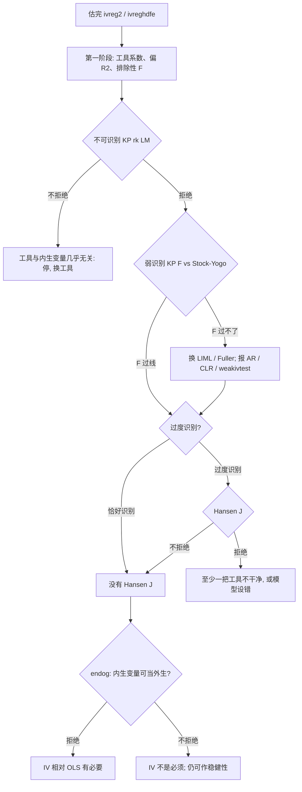

# stata-regression-iv-testing

> **加载时机**：[iv.md](iv.md) 已读完，命令选定后，需要读检验结果 / 写论文表注 / 处理弱工具时加载本文件。
>
> **边界约定**：本文件只讲「检验 + 出表 + 论文写法」。五命令语法见 [iv.md](iv.md)；`ivreghdfe` 安装与版本 bug 见 [ivreghdfe.md](ivreghdfe.md)。四件套陷阱统一在主 `SKILL.md`，不重复。

---

## 10.9 工具变量一整套检验（扩展，教材未覆盖）

IV 能站住，靠的是相关和外生。相关可以检验；恰好识别时外生不能检验；内生性检验只回答「要不要做 IV」，不证明工具干净。按这个顺序读结果：第一阶段 → 不可识别 → 弱识别 →（弱了就上稳健推断）→ 过度识别 / 子集外生 → 内生性。



> 外生性（排除性限制）在恰好识别时没有统计检验。Hansen / Sargan 只在工具比内生变量多时才存在，且不拒绝不等于工具外生。制度故事、安慰剂、工具到 y 的其他通道，比 J 检验重要。

### 检验总表

| 检验 | 问的是什么 | 常用统计量 | H0 | 想看到 | 做不了的时候 |
| --- | --- | --- | --- | --- | --- |
| 第一阶段 | 工具是否相关 | 排除性 F、偏 R²、Shea 偏 R² | 排除性工具系数全为 0 | 拒绝；F 够大 | — |
| 不可识别 | 工具是不是完全没用 | KP rk LM；Anderson LM | 不可识别（秩不足） | 拒绝，p 通常 < 0.05 | — |
| 弱识别 | 相关是否弱到推断失真 | KP rk Wald F；Cragg-Donald F；effective F | 弱识别 | F 超过临界值 | — |
| 过度识别 | 多余工具是否像外生 | Hansen J；Sargan | 全部工具外生 | 不拒绝 | 恰好识别 |
| 子集外生 | 某几把工具是否格格不入 | C / difference-in-Hansen（`orthog()`） | 点名的工具外生 | 不拒绝 | 恰好识别；或点名后不再识别 |
| 内生性 | 疑似内生变量能否当外生 | `endog()`；Durbin / Wu-Hausman；Wooldridge | 可当外生 | 拒绝 → 值得做 IV | `estat endogenous` 在 LIML 后不可用 |
| 弱工具稳健推断 | β=0 是否还站得住 | AR、CLR、Stock-Wright | β=β₀（AR 在过度识别时还叠了外生） | 按研究假设拒绝或接受 | 见下节限制 |
| 工具冗余 | 某几把工具是否白占自由度 | `redundant()` | 点名工具对识别无贡献 | 拒绝 → 留着有用 | — |

聚类或 `robust` 之后：不可识别、弱识别用 Kleibergen-Paap，过度识别用 Hansen J。不要报 Anderson / Cragg-Donald / Sargan。

### 一次跑完，看脚注

`ivreg2` / `xtivreg2` / `ivreghdfe` 加 `first` 出第一阶段回归，加 `ffirst` 再出 Shea 偏 R²、排除性 F，以及脚注里的 Anderson-Rubin / Stock-Wright。`endog()` 把内生性检验打在同一张表上。

```stata
* 截面 / 混合：四条主检验 + 第一阶段 + 弱工具稳健脚注
ivreg2 y x2 x3 (x1 = z1 z2), cluster(id) first ffirst endog(x1)

* 高维 FE：同一套
ivreghdfe y x2 x3 (x1 = z1 z2), absorb(id year) cluster(id) ///
    first ffirst endog(x1)

* 官方命令：检验要事后一条条跑
ivregress 2sls y x2 x3 (x1 = z1 z2), vce(cluster id) first
estat firststage
estat endogenous
estat overid
```

`xtivreg` 没有这套脚注。估完用同一设定改跑 `xtivreg2` / `ivreghdfe`，或后面的 `xtoverid`。

### 1. 第一阶段：相关

第一阶段是：

> x1 = π1·z1 + π2·z2 + γ2·x2 + γ3·x3 + v

排除性工具的联合显著性才是「第一阶段 F」。控制变量和固定效应必须与第二阶段相同。`first` 打完整回归；`ffirst` 打摘要。多个内生变量时看 Shea 偏 R²：普通偏 R² 高、Shea 低，说明两套第一阶段共线，联合识别弱。

```stata
ivreg2 y x2 x3 (x1 = z1 z2), cluster(id) first ffirst
* 或
ivregress 2sls y x2 x3 (x1 = z1 z2), vce(cluster id)
estat firststage
estat firststage, all          // 多个内生时把每个第一阶段都打出来
```

论文里至少报：排除性工具的系数和标准误、符号是否符合制度故事、排除性 F（聚类时用稳健/聚类 F）。不要只写「第一阶段显著」。

手动 `reg x1 z1 z2 x2 x3, cluster(id)` 再 `test z1 z2` 只能核对系数，不能拿去当第二阶段标准误。

### 2. 不可识别

H0：排除性工具与内生变量的偏相关矩阵秩不足，模型不可识别。一个内生、一把工具时，这就是「偏相关为零」。要拒绝。

- iid：Anderson canonical correlation LM
- `robust` / `cluster` / HAC：Kleibergen-Paap rk LM

```stata
ivreg2 y x2 x3 (x1 = z1 z2), cluster(id)
* 脚注：Underidentification test (Kleibergen-Paap rk LM statistic)
* e(idstat)  统计量
* e(idp)     p 值
* e(iddf)    自由度 = 工具数 - 内生数 + 1 这一侧的秩检验自由度
```

不拒绝：工具在控制了 x2、x3 和 FE 之后几乎没有剩余变异，后面的弱识别、J、第二阶段都不可信。先停，换工具或改设定。

拒绝只说明「不是完全无关」，不说明够强。下一步看弱识别。

### 3. 弱识别

工具可以相关但很弱。弱工具下 2SLS 偏向 OLS，Wald 检验实际水平远大于名义 5%。

- iid：Cragg-Donald Wald F。一个内生变量时，它就是排除性工具的第一阶段 F。
- 稳健/聚类：Kleibergen-Paap rk Wald F。聚类后只报这个。
- 多个内生：单个第一阶段 F 不够。看 KP / CD 的最小特征值，以及 `ffirst` 里较新 `ivreg2` 给出的 Sanderson-Windmeijer 条件 F。

```stata
ivreg2 y x2 x3 (x1 = z1 z2), cluster(id) ffirst
* e(widstat)  弱识别 F（有 cluster/robust 时是 KP F）
* e(cdf)      Cragg-Donald F（脚注仍会打，但聚类后不要当主证据）
```

对照脚注里的 Stock-Yogo (2005) 临界值，不要死记 F>10。Staiger-Stock 的 10 大约对应「1 个内生、3 把工具、15% maximal size」，不是普遍安全线。

Stock-Yogo 分两套，都针对 Cragg-Donald、并且假设 iid：

- **maximal IV size**：名义 5% 的 Wald 检验，最坏情况下实际水平不超过 10% / 15% / 20% / 25%。恰好识别也能用。
- **maximal IV relative bias**：2SLS 相对 OLS 的偏误比。需要过度识别，恰好识别时脚注不给这套。

1 个内生、1 把工具时，size 临界值是固定的：

| 容忍的 maximal IV size | 临界值 |
| --- | --- |
| 10% | 16.38 |
| 15% | 8.96 |
| 20% | 6.66 |
| 25% | 5.53 |

工具一多，临界值往上走：更多弱工具会加大偏误，F 必须更高才补得回来。多内生、多工具的数字直接抄脚注，不要手查旧表。

聚类后把 KP F 对着这张 iid 表比，是文献惯例，严格说对不上。更干净的预检验是 Montiel Olea-Pflueger effective F：

```stata
ivreg2 y x2 x3 (x1 = z1 z2), cluster(id)
weakivtest
* 看 F_eff，以及输出里 TSLS / LIML 在 tau = 5%, 10%, 20%, 30% 的临界值
* 不要沿用 Stock-Yogo 的 16.38 去卡 F_eff
```

`weakivtest` 接在 `ivreg2` / `ivreghdfe` / `xtivreg2` 后面，并要求先安装 `avar`（`ssc install avar`）。F 过不了临界值：主结果改 LIML 或 `fuller(1)`，并报下一节的弱工具稳健推断，不要只把 2SLS 的 t 值写进正文。

### 4. 弱工具稳健推断

预检验说「够强」之后，普通 2SLS 的 z / t 才靠得住。弱了，或者审稿人咬弱工具，直接检验 H0: β=β₀（通常 β₀=0），不依赖「第一阶段很强」。

三类统计量：

- **Anderson-Rubin (AR)**：恰好识别时就是弱工具稳健的 β=β₀ 检验；过度识别时检验的是联合假设「β=β₀ 且过度识别限制成立」。拒绝可能是 β≠0，也可能是工具不外生。
- **CLR**（Moreira）：过度识别时比 AR 更有势。稳健/聚类 VCE 用的是 Finlay-Magnusson 的推广。
- **Stock-Wright LM S**：`ivreg2, ffirst` 脚注里会打。

恰好识别时 AR 与 CLR 等价。

```stata
* ---- A. ivreg2 脚注自带 AR 与 Stock-Wright（最省事，ivreghdfe 也能用）----
ivreg2 y x2 x3 (x1 = z1 z2), cluster(id) ffirst
ivreghdfe y x2 x3 (x1 = z1 z2), absorb(id year) cluster(id) ffirst
* 脚注：
* Anderson-Rubin Wald test F / Chi-sq
* Stock-Wright LM S statistic
* H0: B1 = 0 and overidentifying restrictions are valid

* ---- B. 官方 ivregress 之后（Stata 19+）----
ivregress 2sls y x2 x3 (x1 = z1 z2), vce(cluster id)
estat weakrobust              // 恰好识别: AR；过度识别: CLR
estat weakrobust, ci          // 单个内生变量才能反演置信区间
estat weakrobust, ar ci       // 强制要 AR 区间
* 区间可能是空集、整条实线、或两段并集；点估计不一定落在区间里

* ---- C. weakiv：ivreg2 / xtivreg2 / ivregress 之后 ----
ivreg2 y x2 x3 (x1 = z1 z2), cluster(id)
weakiv
weakiv, graph(ar clr)         // 一个内生: 画 AR / CLR 置信集
* 或一条命令估完再检
weakiv ivreg2 y x2 x3 (x1 = z1 z2), cluster(id) graph(ar k j kj)
```

`estat weakrobust, ci` 只支持一个内生变量。`weakiv` 两个内生变量时可画二维置信集。`weakiv` 认 `ivregress` / `ivreg2` / `xtivreg` / `xtivreg2`，**不认 `ivreghdfe`**；要对高维 FE 做 CLR 区间，用 `ffirst` 的 AR / Stock-Wright，或把同一模型改写成 `xtivreg2`。

### 5. 过度识别（外生性的间接检验）

工具数 L > 内生变量数 K 时，多出来的 L-K 个限制可检验。H0：全部排除性工具都与结构残差正交。想要的是**不拒绝**。

| 估计与 VCE | 统计量 | 命令 |
| --- | --- | --- |
| 2SLS，普通 VCE | Sargan、Basmann | `estat overid`；`ivreg2` 脚注 |
| 2SLS，稳健/聚类 | Wooldridge score；Hansen J | `estat overid`；`ivreg2` 脚注 |
| LIML | Anderson-Rubin LR、Basmann F | `estat overid`（这是过度识别，不是上一节的弱工具 AR） |
| GMM / `gmm2s` | Hansen J | `estat overid`；脚注 |

```stata
* 必须过度识别，否则不要跑
ivreg2 y x2 x3 (x1 = z1 z2), cluster(id)
* Hansen J statistic ... Chi-sq(1)  P-val = ...
* e(j)   J 统计量
* e(jp)  p 值
* e(jdf) 自由度 = L - K

ivregress 2sls y x2 x3 (x1 = z1 z2), vce(cluster id)
estat overid

ivregress gmm y x2 x3 (x1 = z1 z2), wmatrix(cluster id) vce(cluster id)
estat overid
```

恰好识别：L=K，J 的自由度为 0，`ivreg2` 会写 `equation exactly identified`。这时外生性只能靠故事。

拒绝 J：至少一把工具不外生，或第二阶段漏变量、函数形式错。它不指出是哪一把。不拒绝：可能都干净，也可能脏工具朝同一方向偏、检验没势。工具又多又弱的时候，J 尤其容易放过。

聚类后只报 Hansen J。Sargan 假设 iid，异方差下会过度拒绝。

### 6. 子集外生：`orthog()` / C 检验

过度识别时，可以点名怀疑的工具，做两个 Hansen-Sargan 的差（C 统计量 / difference-in-Hansen）。H0：点名的那些工具外生（其余工具维持为外生）。

```stata
* 维持 z1 外生，检验 z2
ivreg2 y x2 x3 (x1 = z1 z2), cluster(id) orthog(z2)
* 脚注 C statistic
* e(cstat) e(cstatp) e(cstatdf)

* 也可以点名「被当成外生的控制」，看它是否其实内生
ivreg2 y x2 x3 (x1 = z1 z2), cluster(id) orthog(x3)
```

拒绝：被点名的工具（或控制）与残差相关，应从工具集拿掉，或改回内生。C 检验的前提是**没被点名的工具真外生**；维持集本身是脏的，C 的指向会反。

### 7. 内生性：要不要做 IV

H0：被测回归元可以当外生，OLS 一致。拒绝 → 值得做 IV。不拒绝 → IV 不是必须；**不证明**回归元外生，更不证明工具外生。弱工具时这个检验没势，也不可靠。

```stata
* ---- ivreg2 / ivreghdfe / xtivreg2：稳健、聚类下用这个 ----
ivreg2 y x2 x3 (x1 = z1 z2), cluster(id) endog(x1)
* 脚注：Endogeneity test of endogenous regressors
* e(estat) e(estatp) e(estatdf)
* 本质是两个 Hansen-Sargan 之差：
*   小工具集：x1 当内生
*   大工具集：x1 当外生（自己当工具）

* ---- 官方 2SLS ----
ivregress 2sls y x2 x3 (x1 = z1 z2), vce(unadjusted)
estat endogenous              // Durbin chi2, Wu-Hausman F

ivregress 2sls y x2 x3 (x1 = z1 z2), vce(robust)
estat endogenous              // Wooldridge robust score + 稳健回归型
* estat endogenous 在 LIML 后不可用
```

不要用经典 `hausman` 去比 OLS 和聚类 IV，VCE 对不上。不要用老命令 `ivendog`，它走 iid 的 Wu-Hausman。

### 8. 工具冗余：`redundant()`

H0：点名的工具对识别没有额外贡献。拒绝说明留着有用；不拒绝可以考虑拿掉，减轻弱工具和 J 检验的负担。这不是外生性检验。

```stata
ivreg2 y x2 x3 (x1 = z1 z2 z3), cluster(id) redundant(z3)
```

### 9. 官方 `xtivreg` 怎么补检验

`xtivreg` 不给 KP / Hansen / `endog()`。同一模型用 `xtivreg2` 或 `ivreghdfe` 重跑最省事。非要留官方 FE/RE，过度识别用 `xtoverid`：

```stata
xtset id year
xtivreg y x2 x3 (x1 = z1 z2), fe vce(cluster id)
xtoverid                      // 稳健/聚类的过度识别
```

弱识别、内生性仍然缺。需要这两条就不要坚持 `xtivreg`。

### 10. 存盘标量

```stata
ivreg2 y x2 x3 (x1 = z1 z2), cluster(id) first ffirst endog(x1) orthog(z2)
ereturn list

* 不可识别
* e(idstat) e(idp) e(iddf)
* 弱识别
* e(widstat)          KP 或 CD，取决于有没有 robust/cluster
* e(cdf)              总是 Cragg-Donald
* 过度识别
* e(j) e(jp) e(jdf)
* 内生性（加了 endog()）
* e(estat) e(estatp) e(estatdf)
* 子集外生（加了 orthog()）
* e(cstat) e(cstatp) e(cstatdf)
```

`weakivtest` 的 effective F 在 `r(F_eff)`，不在 `e()`。要 `estadd` 进表，必须紧接在 `weakivtest` 之后取 `r()`。

### 结果怎么判

- KP LM 不拒绝：不可识别。换工具，不要解释第二阶段。
- KP F 低于 10% size 临界值（恰好识别时是 16.38）：当弱工具。主估计换 LIML / `fuller(1)`，正文报 AR / CLR，附录可以留 2SLS。
- KP F 过线、J 拒绝：相关够，外生不够。拆开 `orthog()`，或丢掉最可疑的工具；恰好识别后 J 消失，要在文字里承认。
- J 不拒绝、`endog` 也不拒绝：工具看起来齐，但 OLS 已够。IV 仍可作稳健性，不要写成「证明了因果」。
- J 不拒绝、`endog` 拒绝：最常见的「可写进论文」组合。外生仍靠制度故事。
- AR 拒绝而 2SLS 的 z 不拒绝（或反过来）：以弱工具稳健推断为准，不要只报更好看的那个。

### 完整模板：从 OLS 到 IV 出表

把变量名换成自己的即可。面板默认走 `ivreghdfe`。

```stata
clear all
set more off

* ------------------------------------------------------------
* 0. 数据与面板结构
* ------------------------------------------------------------
use "yourdata.dta", clear
xtset id year
global Y    y
global X    x1                 // 内生
global W    x2 x3 x4           // 外生控制
global Z    z1                 // 排除性工具；多个就写 z1 z2
global CLU  id

* ------------------------------------------------------------
* 1. OLS 对照（同一套控制与 FE）
* ------------------------------------------------------------
eststo clear
eststo ols: reghdfe $Y $X $W, absorb(id year) cluster($CLU)

* ------------------------------------------------------------
* 2. IV：第一阶段 + 第二阶段
* ------------------------------------------------------------
eststo iv: ivreghdfe $Y $W ($X = $Z), absorb(id year) cluster($CLU) ///
    first ffirst savefirst savefprefix(fs_) endog($X)

* 不可识别、弱识别、Hansen J、内生性
* 恰好识别时 e(j) e(jp) 是缺失值，表里那两行会空着
estadd scalar kp_f    = e(widstat) : iv
estadd scalar id_lm   = e(idstat)  : iv
estadd scalar id_p    = e(idp)     : iv
estadd scalar hansen  = e(j)       : iv
estadd scalar hansenp = e(jp)      : iv
estadd scalar endog   = e(estat)   : iv
estadd scalar endogp  = e(estatp)  : iv

* ------------------------------------------------------------
* 3. 弱工具稳健：effective F，以及脚注里的 AR
*    weakivtest 必须紧接在本次 IV 估计之后，F_eff 在 r() 不在 e()
* ------------------------------------------------------------
quiet ivreghdfe $Y $W ($X = $Z), absorb(id year) cluster($CLU)
weakivtest
estadd scalar f_eff = r(F_eff) : iv

estadd scalar kp_f  = e(widstat) : fs_$X
estadd scalar f_eff = r(F_eff)   : fs_$X

* ------------------------------------------------------------
* 4. 出表
* ------------------------------------------------------------
esttab fs_$X iv ols using "iv_results.rtf", replace ///
    se star(* 0.10 ** 0.05 *** 0.01) b(3) se(3) ///
    order($Z $X $W) ///
    stats(N r2 kp_f f_eff id_lm id_p hansen hansenp endog endogp, ///
          fmt(0 3 3 3 3 3 3 3 3 3) ///
          labels("N" "R2" "KP rk Wald F" "Effective F" ///
                 "KP rk LM" "KP LM p" "Hansen J" "Hansen J p" ///
                 "Endogeneity" "Endogeneity p")) ///
    mtitles("First stage" "IV-2SLS" "OLS") ///
    indicate("Firm FE = id" "Year FE = year") ///
    nogaps compress
```

截面把第 1-2 步换成：

```stata
eststo ols: regress $Y $X $W, vce(cluster $CLU)
eststo iv:  ivreg2  $Y $W ($X = $Z), cluster($CLU) first savefirst savefprefix(fs_) endog($X)
```

只用官方命令：

```stata
eststo ols: regress $Y $X $W, vce(robust)
eststo iv:  ivregress 2sls $Y $W ($X = $Z), vce(robust) first
estat firststage
estat endogenous
estat overid
```

### 检验在论文里怎么写

正文只报第二阶段关注系数。表里单独开一列第一阶段，表注堆诊断。聚类标准误下不要出现 Cragg-Donald 或 Sargan。

1. **第一阶段**：排除性工具的系数、标准误、符号是否符合制度故事。
2. **不可识别**：Kleibergen-Paap rk LM 及其 p 值。要拒绝。
3. **弱识别**：Kleibergen-Paap rk Wald F，对照脚注 Stock-Yogo。恰好识别、1 个内生 1 把工具时，10% maximal size 临界值是 16.38。过不了就不要只报 2SLS 的 t。有空间再报 `weakivtest` 的 effective F。
4. **弱工具稳健**：F 偏低或审稿人咬弱工具时，报 Anderson-Rubin（`ffirst` 脚注）或 `estat weakrobust` / `weakiv` 的 CLR 区间。
5. **过度识别**：L>K 才报 Hansen J 及其 p 值。不拒绝不是外生性证明；恰好识别时这一行删掉，不要写「通过了过度识别检验」。
6. **内生性**：`endog()`。拒绝只说明 IV 相对 OLS 有必要。

外生性的主证据是制度故事、安慰剂、以及工具到 y 的其他通道被堵住。J 检验只是附属。子集怀疑用 `orthog()`，不要把所有工具塞进一个 J 里完事。
