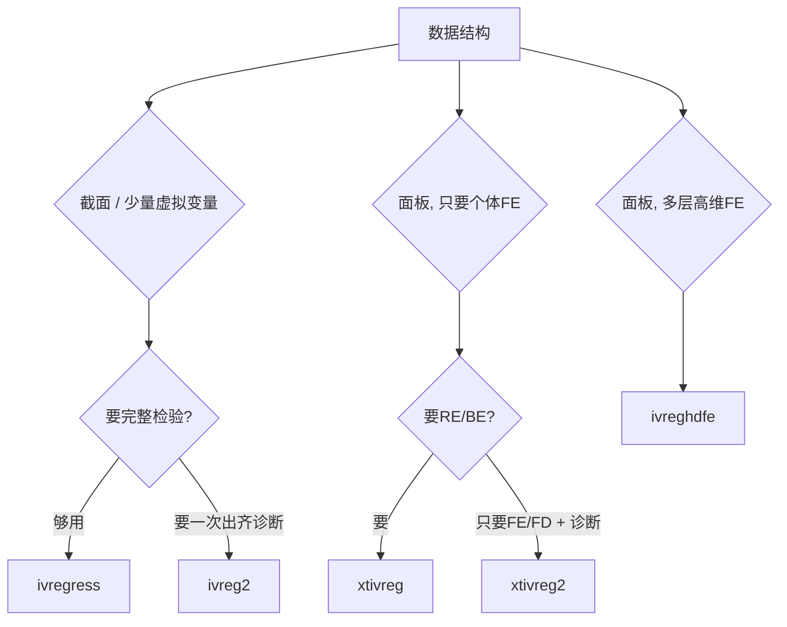

# stata-regression-iv

> **加载时机**：主 `SKILL.md` 强制路径已读完，遇到「IV / 工具变量 / 内生性 / 弱工具」时加载本文件。
>
> **边界约定**：本文件只讲「五命令怎么选 + 语法」。检验体系（第一阶段 F / KP F / Hansen J / 内生性 / 弱工具稳健推断）见 [iv-testing.md](iv-testing.md)。四件套陷阱统一收录在主 `SKILL.md`「关键陷阱速查」，不重复。

---

## 10.8 工具变量五命令：怎么选（扩展，教材未覆盖）

经管实证里，Stata 做线性 IV 几乎就这五条命令。官方自带 `ivregress` / `xtivreg`，日常投稿更常用外部包 `ivreg2` / `xtivreg2` / `ivreghdfe`。难的不是敲命令，是第一阶段够不够强、工具是否外生、标准误有没有和数据结构对齐。

### 统一符号约定

`y` 被解释变量，`x1` 内生解释变量，`x2 x3` 外生控制，`z1 z2` 排除性工具。括号写法永远是 `(内生变量 = 排除性工具)`，控制变量写在括号外面——它们同时进入第一阶段和第二阶段。



> 不要手搓两阶段：先 `reg x1 z1 x2 x3` 再 `predict x1hat` 再 `reg y x1hat x2 x3`。第二阶段标准误把拟合值当成真实数据，通常偏小；控制变量也容易漏进第一阶段。始终用下面的 IV 命令一次估完。

### 先装外部包

```stata
* 只需装一次
ssc install ivreg2, replace
ssc install ranktest, replace      // ivreg2 弱识别/不可识别检验依赖它
ssc install xtivreg2, replace
ssc install ftools, replace
ssc install reghdfe, replace
ssc install ivreghdfe, replace
ssc install estout, replace        // 出表
ssc install weakivtest, replace    // 可选：Olea-Pflueger effective F
ssc install weakiv, replace        // 可选：AR / CLR 弱工具稳健推断
ssc install xtoverid, replace      // 可选：xtivreg 后的过度识别
```

### 五命令对比表

| 命令 | 来源 | 估计量 | 固定效应 | 诊断 | 适用 |
| --- | --- | --- | --- | --- | --- |
| `ivregress` | 官方 | 2SLS / LIML / GMM | 自己写 `i.year`，高维个体 FE 很吃力 | 事后 `estat` | 截面、教学、官方可复现 |
| `ivreg2` | Baum-Schaffer-Stillman | 2SLS / LIML / GMM2S / CUE | 同上，`partial()` 可吸收少量外生变量 | 一次打印不可识别、弱识别、过度识别、内生性 | 截面或混合面板的默认选择 |
| `xtivreg` | 官方 | 面板 2SLS:FE / RE / BE / FD | 个体内变换，时间 FE 仍要自己加 | 弱，投稿不够用 | 只要官方 FE/RE/FD，不靠诊断 |
| `xtivreg2` | Schaffer | 同 `ivreg2` | 只做 `fe` 或 `fd`，必须二选一 | 继承 `ivreg2` 全套 | 面板只要个体 FE/FD |
| `ivreghdfe` | Correia | 同 `ivreg2` | `absorb()` 多层高维 FE | 继承 `ivreg2` 全套 | 企业-年份、城市-年份的默认选择 |

**观点**：截面用 `ivreg2`；面板有个体+时间（或行业-年份）FE，直接 `ivreghdfe`。`xtivreg` 只在需要随机效应 G2SLS / EC2SLS，或审稿人点名官方命令时才值得单独跑。`ivregress` 适合核对官方结果，以及要用 LIML / GMM 后再接 `estat weakrobust`。

### 1. `ivregress`：官方截面 IV

语法：

```stata
ivregress estimator y [外生控制] (内生变量 = 工具) [if] [in] [weight], options
```

`estimator` 只能是 `2sls`、`liml`、`gmm` 之一。2SLS / LIML 默认普通 VCE；GMM 默认按 `wmatrix()` 给稳健加权。弱工具时，LIML 的有限样本偏误通常小于 2SLS / GMM。

```stata
* ---- 2SLS，异方差稳健 ----
ivregress 2sls y x2 x3 (x1 = z1 z2), vce(robust) first
estat firststage          // 第一阶段 F、偏 R2；稳健 VCE 时给稳健 F
estat endogenous          // 内生性；LIML 后不可用
estat overid              // 过度识别；恰好识别时不要跑

* ---- 聚类 ----
ivregress 2sls y x2 x3 (x1 = z1 z2), vce(cluster id) first
estat firststage
estat endogenous
estat overid

* ---- LIML：弱工具时优先于 2SLS ----
ivregress liml y x2 x3 (x1 = z1 z2), vce(robust) first
estat firststage
estat overid              // Anderson-Rubin LR + Basmann F
* estat endogenous        // 不可用

* ---- 两步 GMM，过度识别且异方差时更有效 ----
ivregress gmm y x2 x3 (x1 = z1 z2), wmatrix(robust) vce(robust)
estat overid              // Hansen J

* ---- 多个内生变量：工具是联合的，不是一一配对 ----
ivregress 2sls y x3 (x1 x2 = z1 z2 z3), vce(cluster id) first
```

`estat` 对应关系：

- 内生性 `estat endogenous`：2SLS 普通 VCE 给 Durbin / Wu-Hausman；2SLS 稳健 VCE 给 Wooldridge score 和稳健回归型检验。显著 → 把被测变量当内生。LIML 后没有这条。
- 过度识别 `estat overid`：2SLS 普通 VCE 给 Sargan / Basmann；2SLS 稳健 VCE 给 Wooldridge score；LIML 给 Anderson-Rubin LR 和 Basmann F；GMM 给 Hansen J。
- 新版本还有 `estat weakrobust`：弱工具稳健的 Anderson-Rubin / CLR；单个内生变量时可给稳健置信区间。

恰好识别（内生个数 = 排除性工具个数）时过度识别统计量没有自由度，不要报 J / Sargan。

### 2. `ivreg2`：日常默认

语法与 `ivregress` 同形，默认 2SLS，脚注一次打出不可识别、弱识别、Hansen/Sargan。加了 `robust` / `cluster` / `bw()` 后，不可识别和弱识别自动换成 Kleibergen-Paap rk，不再用假设 iid 的 Anderson / Cragg-Donald。

```stata
* ---- 默认 2SLS + 稳健 + 第一阶段 ----
ivreg2 y x2 x3 (x1 = z1 z2), robust first

* ---- 聚类；弱识别看 KP Wald F，不要看 CD F ----
ivreg2 y x2 x3 (x1 = z1 z2), cluster(id) first endog(x1)

* ---- 第一阶段另存，方便和二阶段一起出表 ----
ivreg2 y x2 x3 (x1 = z1 z2), cluster(id) first savefirst savefprefix(fs_)
estimates dir             // 二阶段是当前估计；第一阶段名 fs_x1

* ---- LIML / Fuller(1) / 两步 GMM / CUE ----
ivreg2 y x2 x3 (x1 = z1 z2), cluster(id) liml first
ivreg2 y x2 x3 (x1 = z1 z2), cluster(id) fuller(1) first
ivreg2 y x2 x3 (x1 = z1 z2), cluster(id) gmm2s first
ivreg2 y x2 x3 (x1 = z1 z2), cluster(id) cue first

* ---- 子集外生：怀疑 z2 不外生 ----
ivreg2 y x2 x3 (x1 = z1 z2), cluster(id) orthog(z2)

* ---- 时间效应：混合面板 ----
ivreg2 y x2 x3 i.year (x1 = z1), cluster(id) first endog(x1)

* ---- 把大量外生变量 partial 掉，只保留关注系数 ----
ivreg2 y x2 x3 i.year (x1 = z1), cluster(id) partial(x2 x3 i.year) small
```

脚注会一次打出不可识别、弱识别、Hansen/Sargan。原假设、临界值、弱工具稳健推断和存盘标量见 [iv-testing.md](iv-testing.md)。聚类后弱识别只报 KP F，不要报 CD F。

### 3. `xtivreg`：官方面板 IV

必须先 `xtset`。五个估计量：默认 RE（Balestra-Varadharajan-Krishnakumar G2SLS），`ec2sls` 换成 Baltagi EC2SLS，`fe` 组内，`fd` 一阶差分，`be` 组间。`fd` 还要求时间变量。

```stata
xtset id year

* 固定效应 2SLS
xtivreg y x2 x3 (x1 = z1 z2), fe vce(cluster id) first

* 一阶差分 2SLS
xtivreg y x2 x3 (x1 = z1 z2), fd vce(cluster id) first

* 随机效应 G2SLS / EC2SLS
xtivreg y x2 x3 (x1 = z1 z2), re vce(cluster id)
xtivreg y x2 x3 (x1 = z1 z2), re ec2sls vce(cluster id)

* 组间
xtivreg y x2 x3 (x1 = z1 z2), be

* 时间 FE：自己加。个体很多时 i.id 不要这么写
xtivreg y x2 x3 i.year (x1 = z1), fe vce(cluster id) first
```

`xtivreg` 不给 KP / Hansen / `endog()`。估完如果还要诊断，用同一套变量改跑 `xtivreg2` 或 `ivreghdfe`。官方 `xtivreg, fe` 在 cluster 时用 N-N_g-K 调整自由度，比 `xtivreg2` 更保守。

### 4. `xtivreg2`：面板 FE/FD + 全套检验

`ivreg2` 的面板壳。只支持 `fe` 和 `fd`，这两个选项必须写一个。FE 不报告常数项。`ivreg2` 3.0 以后支持双向聚类。cluster 且 FE 时，不对个体 FE 个数做自由度调整（Arellano 1987）；若某个 panel 跨多个 cluster，命令会报错退出。

```stata
xtset id year

xtivreg2 y x2 x3 (x1 = z1 z2), fe cluster(id) first endog(x1)
xtivreg2 y x2 x3 (x1 = z1 z2), fd cluster(id) first endog(x1)

* 时间 FE：写进回归，或 partial 掉
xtivreg2 y x2 x3 i.year (x1 = z1), fe cluster(id) first endog(x1)
xtivreg2 y x2 x3 (x1 = z1), fe cluster(id) partial(i.year) small first

* LIML / GMM
xtivreg2 y x2 x3 (x1 = z1 z2), fe cluster(id) liml first
xtivreg2 y x2 x3 (x1 = z1 z2), fe cluster(id) gmm2s first

* 双向聚类（ivreg2 ≥ 3.0）
xtivreg2 y x2 x3 (x1 = z1), fe cluster(id year) first
```

个体 FE + 时间 FE 时，`xtivreg2 ... i.year, fe` 能跑，但时间维很大或还要行业-年份 FE 时，改 `ivreghdfe`。

### 5. `ivreghdfe`：高维 FE 的默认

`ivreg2` + `reghdfe`。`absorb()` 打开后会强制 `ivreg2` 的 `small`、`noconstant`、`nopartialsmall`。`first` / `savefirst` / `savefprefix()` / `endog()` / `gmm2s` / `liml` 都能用。

```stata
* 个体 + 年份
ivreghdfe y x2 x3 (x1 = z1 z2), absorb(id year) cluster(id) first endog(x1)

* 个体 + 行业-年份
ivreghdfe y x2 x3 (x1 = z1), absorb(id ind#year) cluster(id) first

* 双向聚类
ivreghdfe y x2 x3 (x1 = z1), absorb(id year) cluster(id year) first

* 存第一阶段
ivreghdfe y x2 x3 (x1 = z1), absorb(id year) cluster(id) ///
    first savefirst savefprefix(fs_) endog(x1)

* LIML / 两步 GMM
ivreghdfe y x2 x3 (x1 = z1 z2), absorb(id year) cluster(id) liml first
ivreghdfe y x2 x3 (x1 = z1 z2), absorb(id year) cluster(id) gmm2s first
```

第一阶段会吸收与第二阶段相同的 `absorb()` 变量。不要先 `reghdfe` 残差化再对残差做 IV，标准误和自由度会对不上。命令的安装、版本、已知 bug 见 [ivreghdfe.md](ivreghdfe.md)。

### 最小对照：同一模型五条命令

```stata
xtset id year

* 官方截面写法 + 时间虚拟变量（个体多时不要 i.id）
ivregress 2sls y x2 x3 i.year (x1 = z1), vce(cluster id) first

* 外部包截面/混合
ivreg2 y x2 x3 i.year (x1 = z1), cluster(id) first endog(x1)

* 官方面板 FE
xtivreg y x2 x3 i.year (x1 = z1), fe vce(cluster id) first

* 面板 FE + 诊断
xtivreg2 y x2 x3 i.year (x1 = z1), fe cluster(id) first endog(x1)

* 高维 FE（推荐）
ivreghdfe y x2 x3 (x1 = z1), absorb(id year) cluster(id) first endog(x1)
```

前四条在「个体 FE + 时间虚拟变量、无其他高维 FE」时应非常接近；`ivreghdfe` 用组内吸收代替虚拟变量，系数应对齐，标准误会因自由度调整略有差别。

### 必须避开的写法

1. **内生变量的平方、交乘也是内生的。** `x1` 内生则 `x1_sq`、`c.x1#c.w` 都要进括号左侧，并用 `z1_sq`、`c.z1#c.w` 当额外工具。写成 `ivreg2 y (x1 = z1 z1_sq)` 只会给 `x1` 两个工具，平方项仍留在外面当外生。

```stata
gen x1_sq = x1^2
gen z1_sq = z1^2
ivreg2 y x2 x3 (x1 x1_sq = z1 z1_sq), cluster(id) first

* 或
ivreg2 y x2 c.w (x1 c.x1#c.w = z1 c.z1#c.w), cluster(id) first
```

2. **多个内生变量不是「一个工具对一个内生」。** `(x1 x2 = z1 z2)` 的意思是 `{z1,z2}` 联合识别 `{x1,x2}`。每个内生变量的第一阶段都会进入全部工具。弱识别要看矩阵秩，单个第一阶段 F 够大不够。

3. **排除性工具不能再当控制。** `z1` 已经在等号右边，就不要写进括号外。括号外的变量被当成外生，同时进入两阶段。

4. **聚类层级和 FE 对齐。** 企业面板默认 `cluster(id)`；处理在行业/城市层、残差同层相关，则聚到处理层。双向聚类：`cluster(id year)`。聚类后弱识别只报 KP F。

5. **动态面板不是这五条命令的工作。** `y[t-1]` 进回归后，FE-IV 通常不够。那是 `xtabond` / `xtabond2` / `xtdpdgmm` 的系统 GMM，另写一套。

### 估计量怎么换

- **恰好识别**：2SLS 与 GMM 数值相同，报 2SLS。
- **过度识别 + 异方差/聚类**：`gmm2s` 比 2SLS 渐近更有效，有限样本不一定更好。主结果用 2SLS，附录换 GMM。
- **弱工具**：先换 LIML 或 `fuller(1)`，再报 Anderson-Rubin / `estat weakrobust` / `weakivtest`。Fuller(1) 往往比 LIML 更稳。
- **CUE**（`ivreg2, cue`）：连续更新 GMM，弱工具时有时优于两步 GMM，计算更慢。
